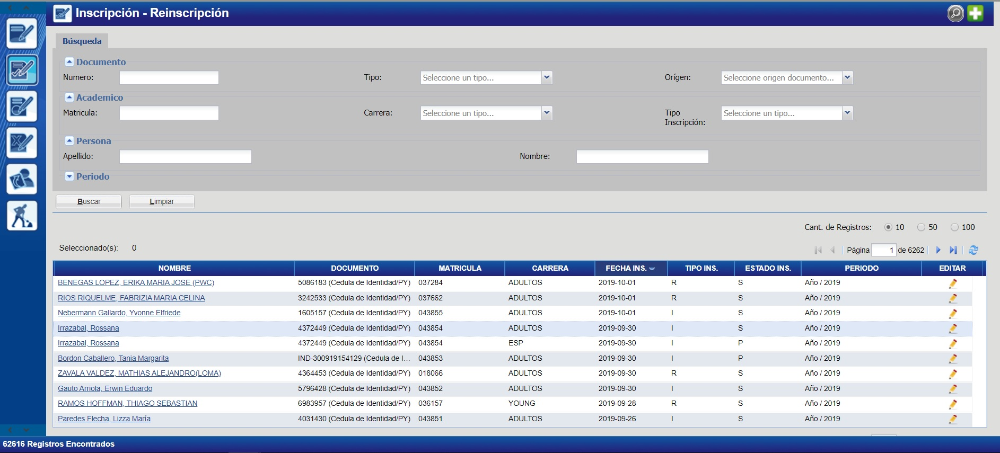
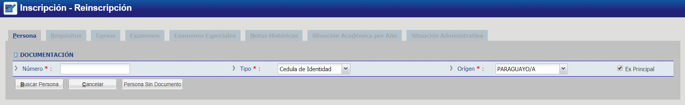
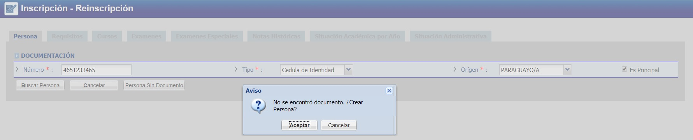
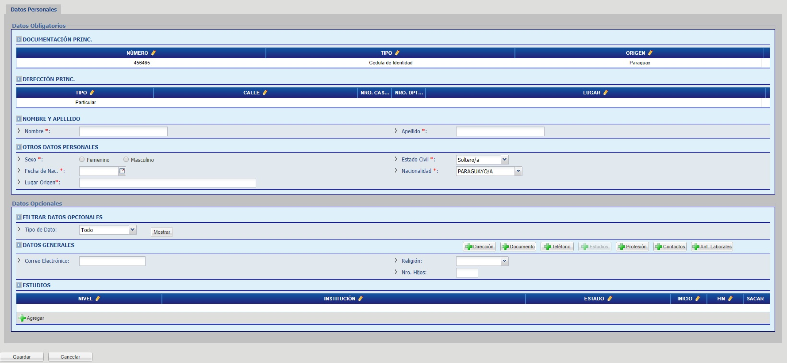
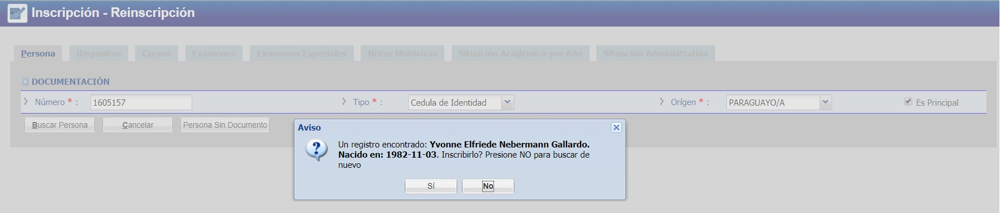
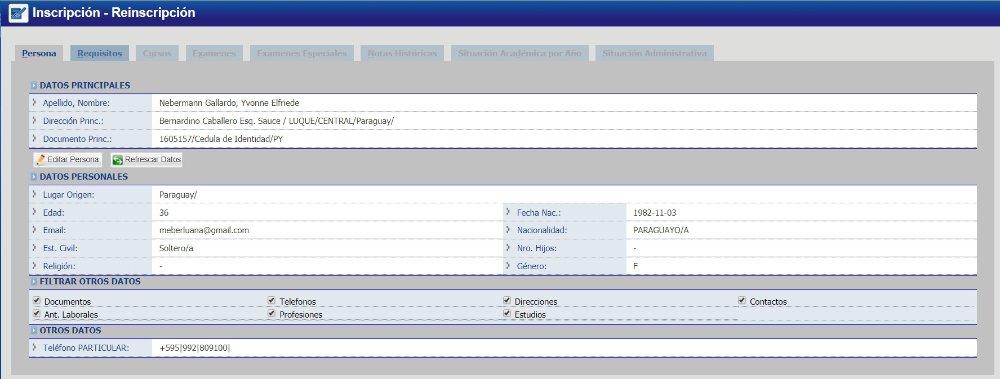
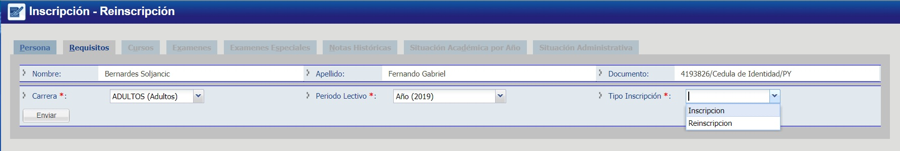
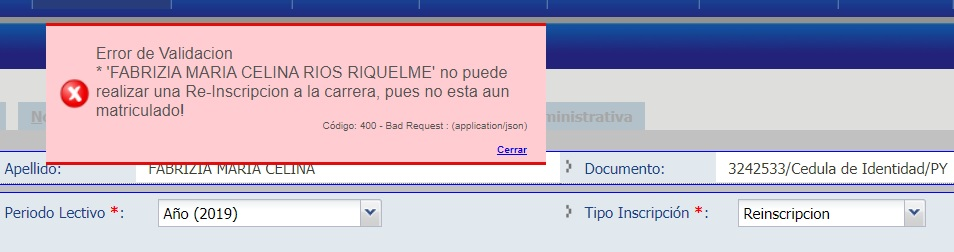
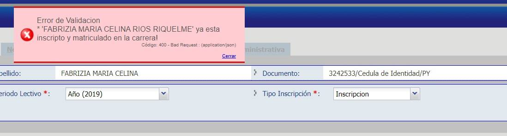

# Inscripciones - Crear

1. Haga click en el botón verde que tiene el símbolo de "+", ubicado en la esquina superior derecha de la imagen.

    

2. Busque a la persona por número de documento.  

    

3. Si no se encontró a la persona, haga click en "Aceptar" para crear una nueva persona.

    

4. Complete los campos necesarios para la creación de la persona y al finalizar haga click en "Guardar".

    

5. Al finalizar el proceso de creación de la persona, haga click en "Si" para inscribir a dicha persona.

    

6. El sistema le mostrará la nueva inscripción creada.

    

7. Seguidamente, hacer click en la pestaña "Requisitos" para introducir los datos de la carrera a inscribir, periodo y el tipo de inscripción..
    
    
    
    _Observación: los tipos de inscripción son: Incripción (Primera vez que esta persona se registra en esta carrera) y Reinscripción (Inscripciones Posteriores)._

###A tener en cuenta
 Cada nuevo periodo (año) se debe crear una nueva inscripción de este tipo para una persona en una carrera para poder agregar cursos en dicho periodo. Esto se debe hacer una sola vez por periodo (año) y carrera.
   
  * Al elegir tipo de “Inscripcion” se muestran los requisitos de dicho periodo. 
  
  * Marcar los requisitos entregados haciendo click en cuadro “Doc. Entregado” que correspondan y guardar “Requisitos”.
  
  * Una vez realizado esto, se habilita la pestaña “Cursos” (link a página de Cursos)

## Preguntas Frecuentes

* En caso de obtener un error como el siguiente:
  
     
  
  Debe cambiar el tipo de inscripción a “Inscripción”

* En caso de obtener un error como el siguiente:
 
     

   Debe cambiar el tipo de inscripción a “Reinscripción”

