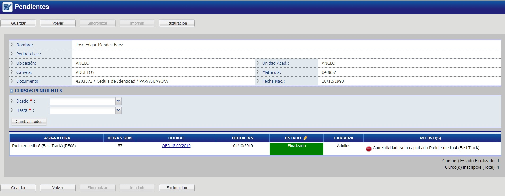

## Manejar Pendientes

## Dar de Baja a Alumno

Haga click en el botón _"Manejar Pendientes"_ lo que le llevara a una nueva página como la que se muestra a continuación:

Se muestran los cursos que esta persona tienen inscriptos en este periodo (pueden aparecer más de uno), encuentre el curso al que desea dar de baja al alumno.

En el curso que se desea quitar, haga doble click en el estado y luego seleccione la opción "Borrado" para darlo de baja. Luego de realizar esto, si la operación se realizó correctamente el estado de dicho curso debe cambiar a “Desinscripto” y mostrarse en color negro.

_Observacion: Si sale de esta página sin presionar “Guardar”, no se realiza ningún cambio en el sistema._
