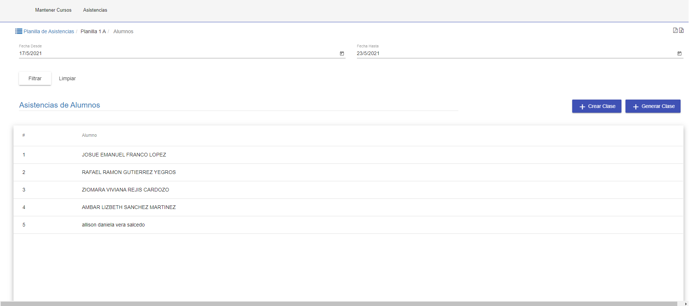
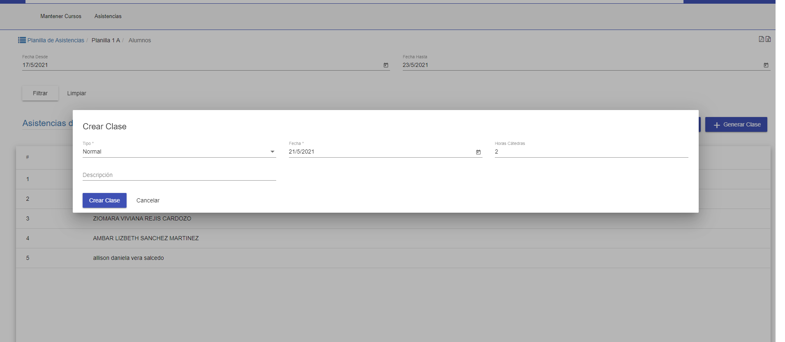
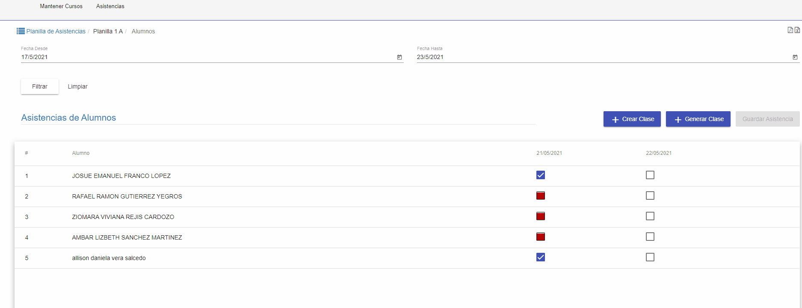
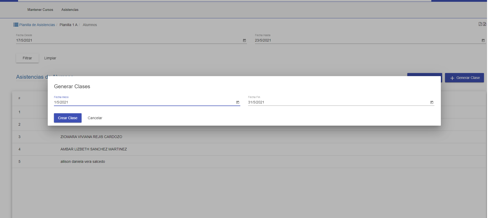
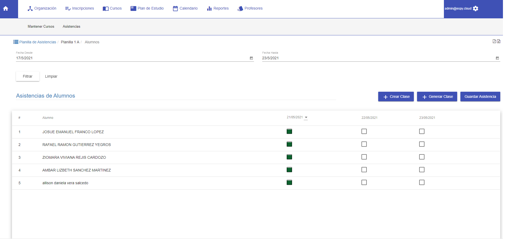
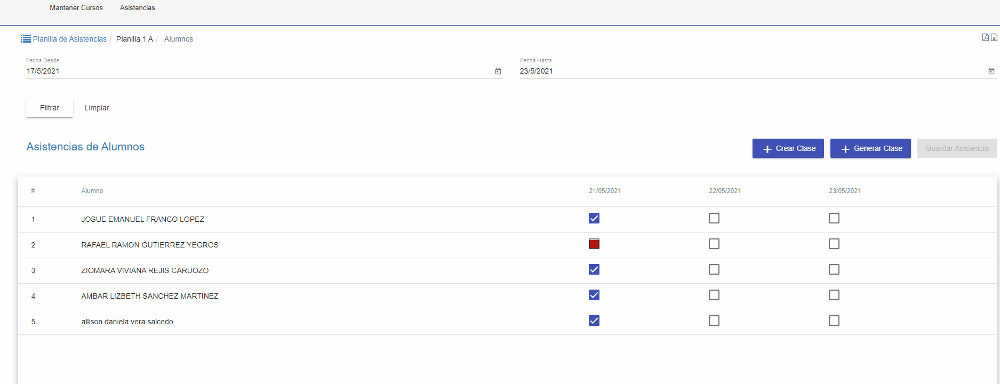

#Asistencias de Alumnos
@@toc { depth=2 }

La funcionalidad de asistencias cursos permite:

* Listar las asistencias de los alumnos.
* Crear Clases para las asistencias.
* Asignar las asistencias de los alumnos

## Listar Asistencia

Al acceder a esta funcionalidad se despliega el listado de asistencias que corresponden a la planilla previamente selecciona. El listado de asistencias
tiene:

* Una sección de filtros, para buscar por rangos de fechas.
* Una grilla, donde se listan las asistencias de los alumnos.

## Filtros

Los filtros permiten buscar asistencias de acuerdo a varios criterios, que pueden combinarse. Algunos criterios son:

* Fecha Desde . Permite buscar las planillas con fecha de inicio mayor o igual al seleccionado.
* Fecha Hasta . Permite buscar las asistencias con fecha de finalizacion menor o igual al seleccionado.

Actualmente la grilla inicializa los filtros con el primer y ultimo día de la semana actual. Luego de completar los filtros requeridos. Se puede pulsar **Filtrar**, para que se muestren los resultados de la
busqueda en la grilla. Si se requiere vaciar o restabler los filtros se puede pulsar **Limpiar** y luego **Filtrar**.

## Grilla

La grilla muestra las asistencias que corresponden al curso de la planilla.La grilla permite asignar la asistencia correspondiente al dia seleccionando el cursor sobre la columna que se quiere modificar

##Crear Clase
Para crear una clase click en el botón Crear Clase. Se muestra una ventana con los datos a completar para crear
la clase:

1. Tipo. Se Selecciona el tipo de clase.
2. Fecha. Se selecciona la fecha de la clase.

##Generar Clase
Para generar las clases pulsar click en el botón Generar Clase. Se muestra una ventana con los datos a completar para crear
la clase:

1. Fecha Desde. Se selecciona el rango de inicio de la fecha de la clase.
2. Fecha Hasta. Se selecciona la rango de final de la fecha de la clase.

##Asignar Asistencia

Al hacer click en una columna en la grilla, se accede a la modificacion de las asistencias del alumno.

La colores de la grilla significan:

* El color verde en la grilla significa que esa columna se esta editando actualmente
* El color rojo significa ausencia del alumno
* El color azul significa que el alumno esta presente.
* El color blanco o sin color significa que no se cargo la asistencia del alumno

