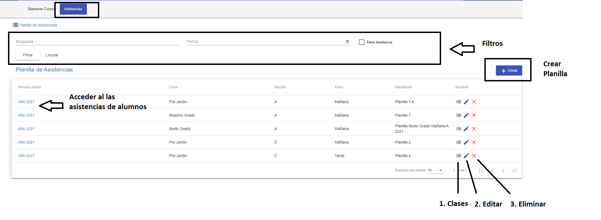
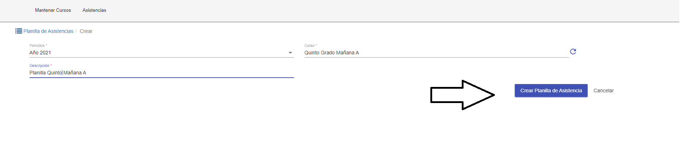
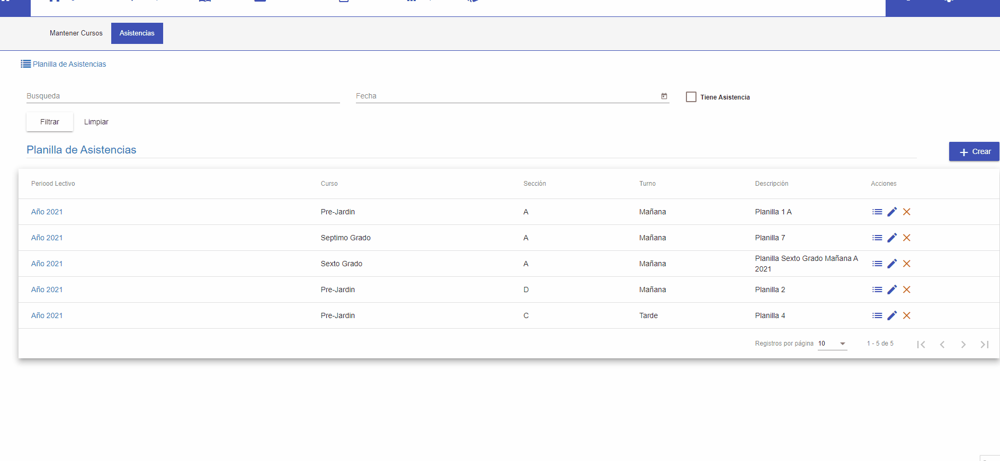

#Planillas de Asistencias
@@toc { depth=2 }

@@@ index
* [Asistencias](asistencias/index.md)
* [Clases](clases/index.md)

@@@

La funcionalidad de asistencias cursos permite:

* Listar las planillas de asistencias del profesor.
* Acceder a las planillas para . Para editar.

## Listar Planillas

Al acceder a esta funcionalidad se despliega el listado de planillas que corresponden al profesor. El listado de planillas
tiene:

* Una sección de filtros, para buscar las planillas.
* Una grilla, donde se listan los planillas que corresponden a el profesor.

## Filtros

Los filtros permiten buscar planillas de acuerdo a varios criterios, que pueden combinarse. Algunos criterios son:

* Busqueda. Permite buscar las planillas por nombre o descripción.
* Fecha . Permite buscar las planillas con fecha en que se cargaron las  asistencias de los alumnos.
* Tiene Asistencia. Permite buscar las planillas a las cuales ya cuentan con asistencias cargadas.

Luego de completar los filtros requeridos. Se puede pulsar **Filtrar**, para que se muestren los resultados de la
busqueda en la grilla. Si se requiere vaciar o restabler los filtros se puede pulsar **Limpiar** y luego **Filtrar**.

## Grilla

La grilla muestra los planillas que corresponden al profesor.La grilla cuentas con los datos como periodo electivo , curso - sección y turno correspondiente de la planilla y descripción de la planilla.  La grilla se actualiza con los resultados de una busqueda con
los filtros. Los resultados se muestran de manera paginada, es decir en grupos de a 10 o 20, que se pueden ir paginando
como un libro, con los botones de **Paginación**

Al hacer click en una planilla en la grilla, se accede a las asistencias ese curso.

##Crear Planilla
Para crear una planilla click en el botón Crear Planilla. Se muestra una ventana con los datos a completar para crear
la planilla:

1. Periodo. Se Selecciona el periodo o año electivo del curso.
2. Curso. Se selecciona el curso.
3. Descripcion. Se utiliza para diferenciar el nombre de las demas planillas.