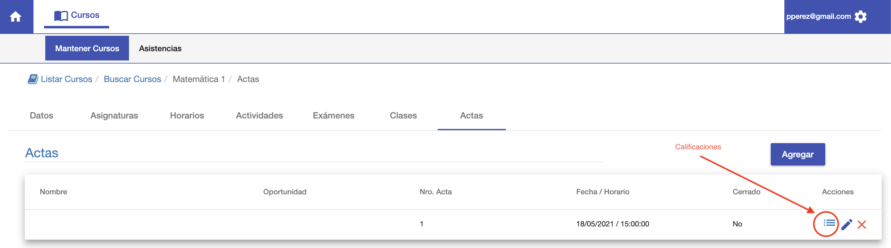
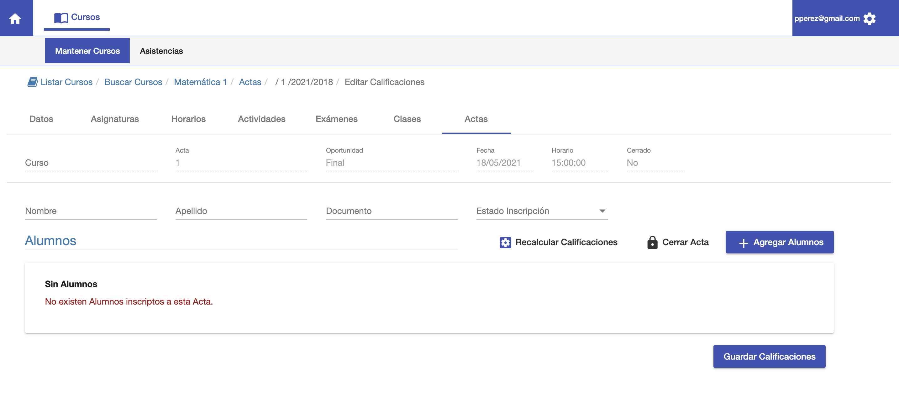
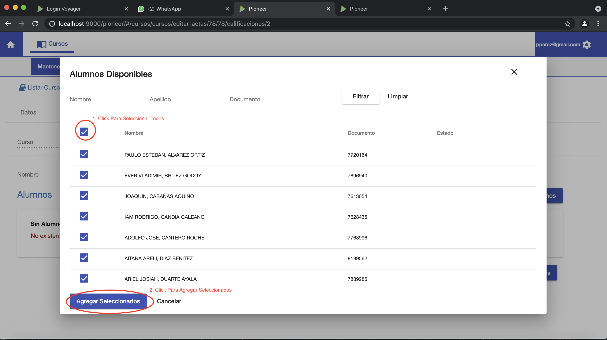
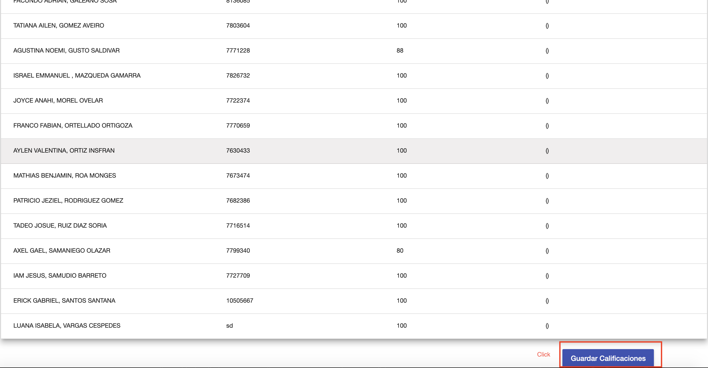
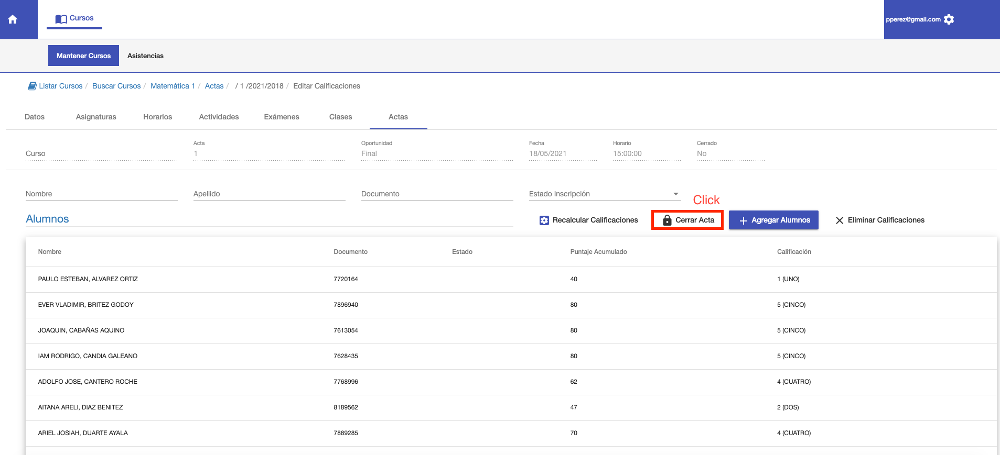
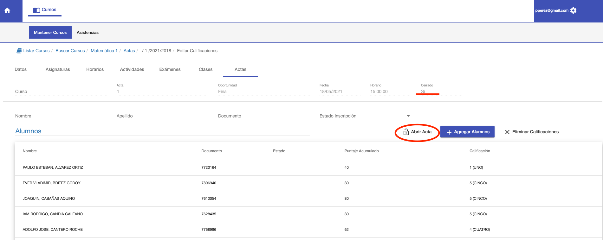

#Calificaciones

Desde el listado de actas al hacer click en el botón de Calificaciones. Se 
accede a la interfaz para incluir a los alumnos en el Acta.

Si no hay alumnos incluidos todavía, se muestra una grilla vacía con el mensaje:
No existen alumnos inscriptos en acta.

##Agregar Alumnos
Para agregar alumnos al acta click en el botón **Agregar Alumnos**. Y se muestra
una ventana con el listado de alumnos disponibles para incluir en acta.
En esta ventana:

1. Seleccionar todos o ir seleccionando de manera individual
los alumnos que se requiere incluir en acta.
2. Click en Agregar Seleccionados, para agregar los alumnos seleccionados
al acta.

Luego de Agregar Seleccionados, el sistema nos muestra una última pantalla de confirmación
con los alumnos que fueron seleccionados y agregados.
Para confirmar, click en botón **Guardar Calificaciones**, que aparece al final de la página. De tal manera
que se pueda revisar a todos los alumnos y luego Guardar Calificaciones.

Al Guardar Calificaciones, quedan ya incluidos los alumnos y sus calificaciones en el Acta.
Puede verificar en el listado, que las notas estén correctamente asignadas y luego Cerrar Acta.

##Cerrar Acta
Una vez que las calificaciones están verificadas se puede hacer click en **Cerrar Acta**, para
confirmar las calificaciones y que queden ya en la ficha de cada alumno.

La interfaz muestra que el acta está cerrada y ofrece un botón para **Abrir Acta**, en caso que se requiera
realizar alguna corrección de puntaje.

