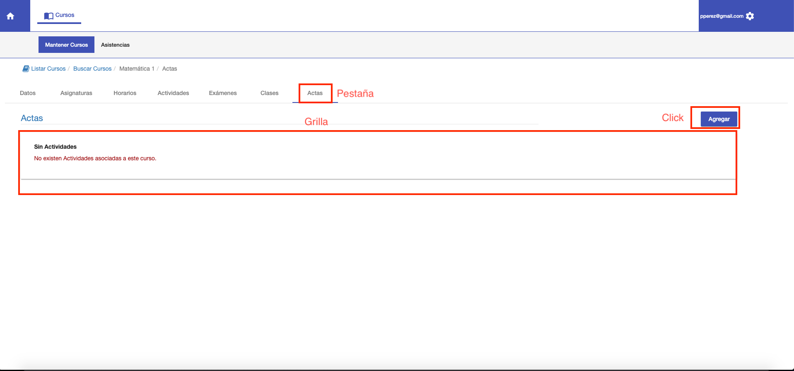
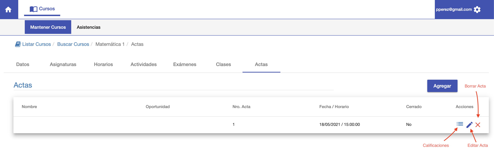

#Listado

Al ingresar a la pestaña Actas se muestra:

1. Una grilla con el listado de actas del curso.
2. Botón Agregar. Para crear un acta.

Si no existen actas, se muestra un mensaje de que no hay actas para el curso.

Si ya existen actas, la grilla permite realizar las siguientes acciones
para cada acta:

1. Mantener Calificaciones. Para agregar los alumnos al acta, si el acta está Abierta.
2. Editar Acta. Para editar datos del acta como Nombre, Fecha etc.
3. Borrar Acta. Se puede borrar si el acta está Abierta.

