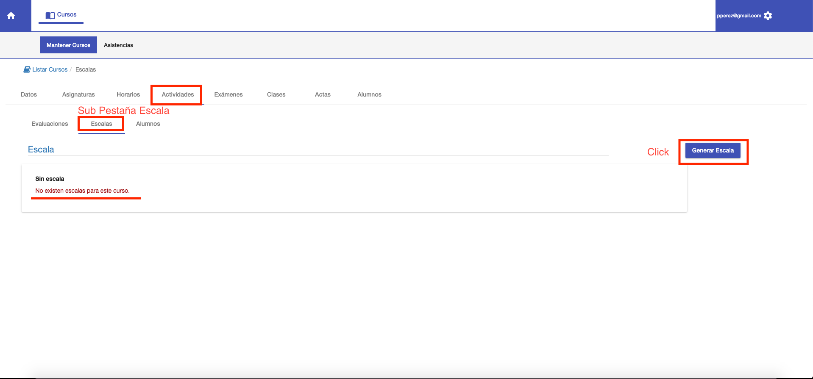
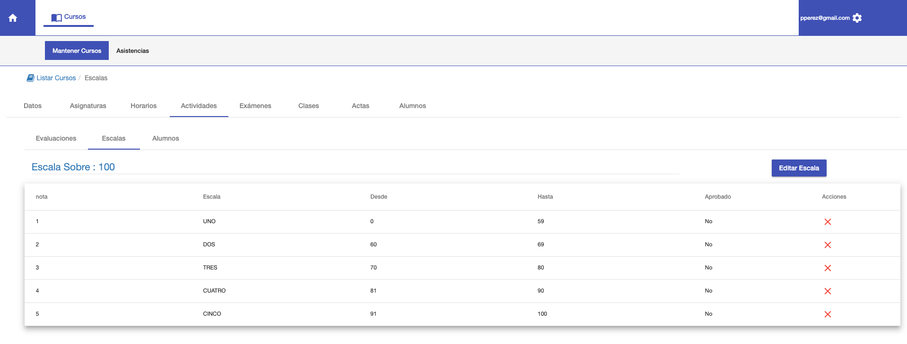
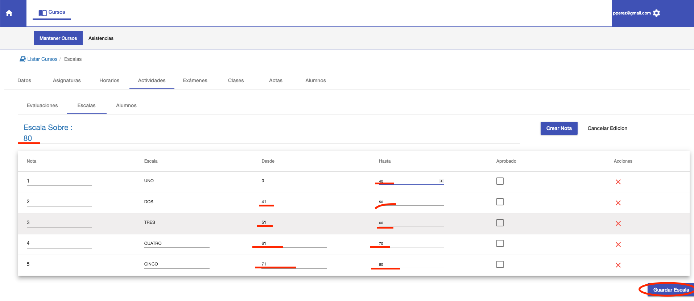
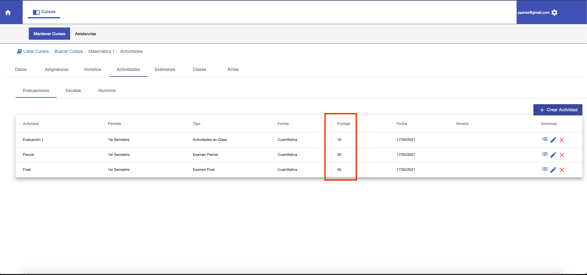

#Escala

La sub pestaña Escalas permite:

1. Asignar el puntaje total del curso.
2. Definir la escala de notas, para ese puntaje

Al ingresar, si el curso no tiene escala se muestra el mensaje:
No existen escalas para este curso. Entonces click en **Generar Escala**:

Al Generar Escala:

1. Se asigna un puntaje total de 100 puntos.
2. Se genera una escala de notas sobre 100 puntos.

Con la escala asignada a un curso. Se calculan las notas finales de los alumnos, según sus puntajes acumulados, en el
acta de calificaciones.

##Editar Escala
Luego de generar la escala, puede editarse si es necesario:
Por ejemplo puede definirse un puntaje total de 80 puntos y definir una escala sobre 80 puntos.
Para ello, click en **Editar Escala** y se habilitan para edición:

1. Puntaje total. Se habilita para modificar.
2. La grilla con la sscala de notas. Cada nota de la grilla se habilita para modificar.

Al cambiar el puntaje, se debe cambiar también la escala de notas para que las
notas sean de acuerdo al nuevo puntaje.
Por ej, al cambiar el puntaje a 80, también se deben cambiar los rangos de notas
de la escala para que se ajusten al nuevo puntaje total:

Para guardar y confirmar los cambios se puede hacer click en **Guardar Escala**.  O en **Cancelar Edición** para 
cancelar los cambios.

## Definir Actividades
Las actividades se pueden definir en base a la escala de 80 puntos:

