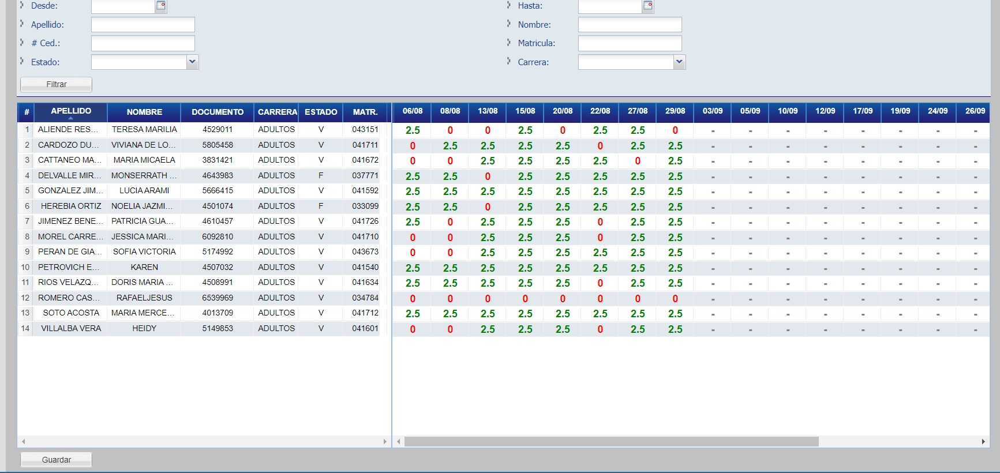
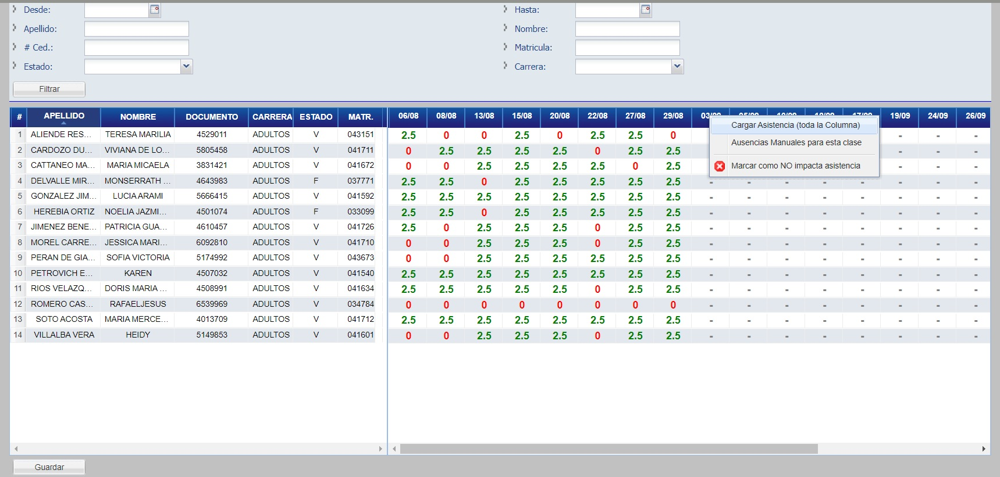
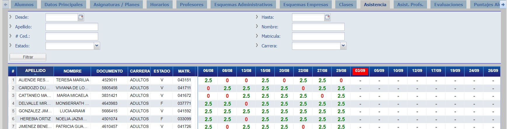
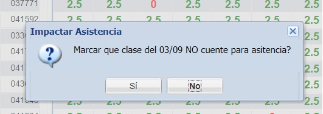

# Asistencia

Haga click en la pestaña "Clases" para visualizar la asistencia del curso.

## Cargar Asistencia

Para agregar la asistencia a un alumno, en una clase (fecha) debe darle doble click a la celda correspondiente de la grilla e ingresar la cantidad de horas de presencia.

Utilizar 0 para alumnos que hayan estado Ausentes, o el total máximo de horas para los alumnos presentes (puede posicionar el puntero del mouse encima de la fecha de la clase, ejemplo “03/09” en el título con fondo azul) para conocer cuántas horas de clase existen ese día.

Cada celda de la grilla permite valores numéricos en el rango 0 a la cantidad máxima de horas, por tanto si un profesor registra a un alumno con llegada tardía, puede agregar la mitad del valor de clases para una media presencia, ejemplo clase de 3 horas, 1.5 horas para ese alumno.

Igualmente puede usar el menú contextual, botón de derecho del mouse sobre la fecha de clase

 
Y la opción “Cargar Asistencia (toda la columna)”, para poner a todos los alumnos en esa fecha como presentes y luego editar a los ausentes, haciendo doble click en cada celda que desea e ingresando el valor 0 (cero) en vez del valor definido en la misma.

## Clase sin Asistencia

Haga click en el día a seleccionar y haga click en "Marcar como NO impacta asistencia"

Se visualizará de la siguiente manera:

Haga click en "Si" para confirmar la transacción y listo.

_Observación: Las clases sin asistencia son las que no se deben computar a los alumnos como presentes ni ausentes, así como no se computan para el total de horas de una clase. 
Utilizar esta opción para días de clase que hayan sido feriados, asuetos, o días en los cuales no se haya dictado dicha clase (por ausencia del profesor o cualquier otra causa de fuerza mayor), o para clases donde el profesor no haya llamado asistencia._

## Filtros

Agregar puede filtrar los resultados por rango de fechas, así cuando quiere cargar la asistencia de un mes de clase, puede utilizar los filtros para seleccionar solamente esos días y no tener tantas columnas en pantalla.

## Preguntas Frecuentes

**Pregunta:** Quiero cargar la asistencia, pero no me sale ninguna fecha de clase, ¿qué hacer?
  
  * **Respuesta:** debe crear o generar las clases para este curso, haciéndolo desde la pestaña de @ref:[Clases](clases.md), recuerde que para esto debe tener creado el @ref:[Horario](horarios.md) de clases para este curso.

**Pregunta:** _¿Qué son las celdas que tienen “guiones” en un fecha y alumno?_
  
  * **Respuesta:** no se ha cargado asistencia a dicha a clase/fecha para ese alumno (ni ausente, ni presente, ni ningún valor). Son celdas en las cuales aún se debe registrar asistencia.

