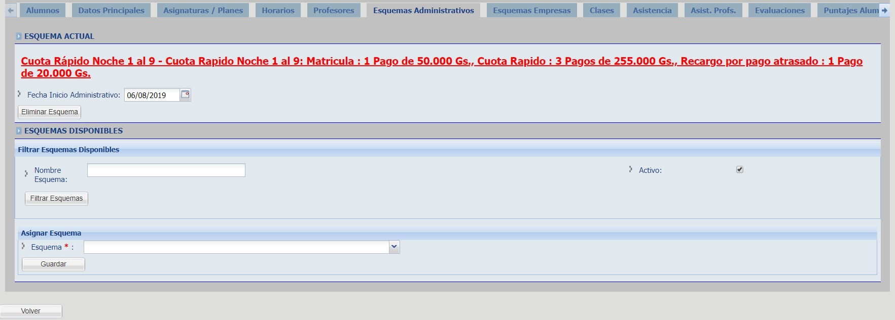

# Esquemas Administrativos

Haga click en la pestaña "Esquemas Administrativos" para visualizar los esquemas administrativos del curso.

## Asignar Esquema

Para asignar un esquema filtre los esquemas disponibles, elija un esquema y haga click en el botón "Guardar".

_Observación: Un esquema es un conjunto de precios, divididos en matrículas, cuotas, etc. según la definición de cada esquema, que asocia un costo a cada curso; el mismo se utiliza para generar las deudas de los alumnos que se inscriben a cada curso en forma particular._

_Consulte con su administrador de sistemas en caso de querer realizar modificaciones en estos valores._
