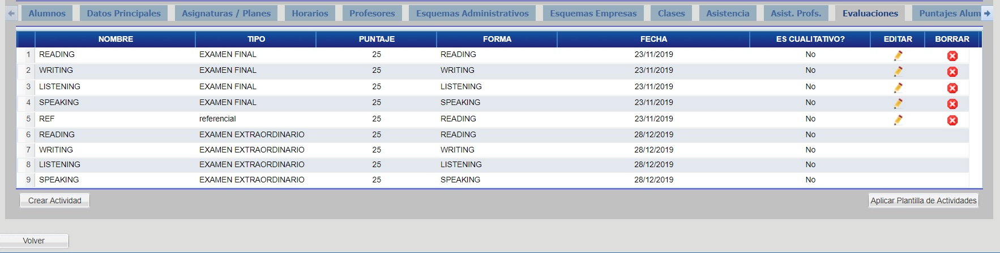
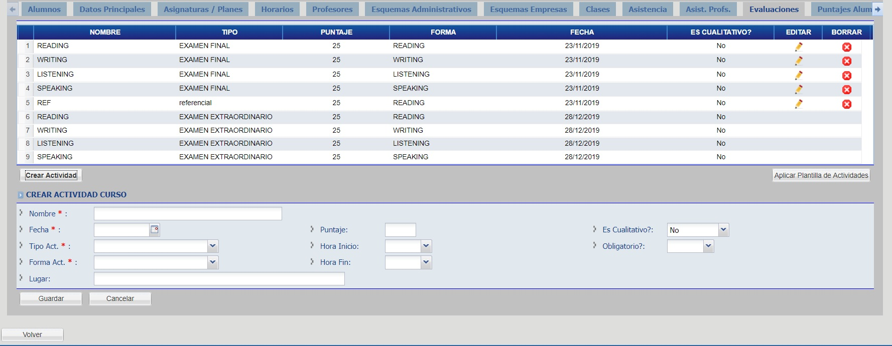
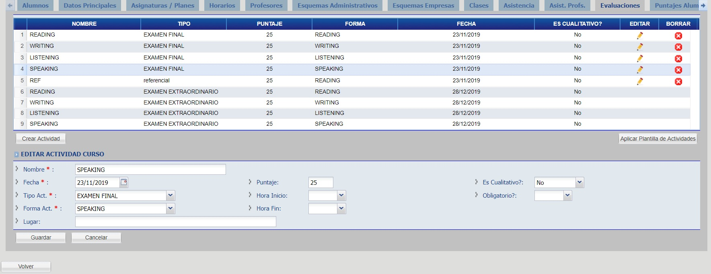
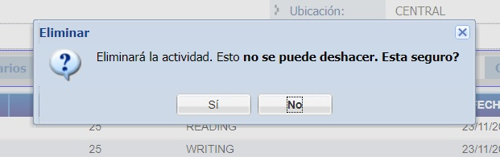
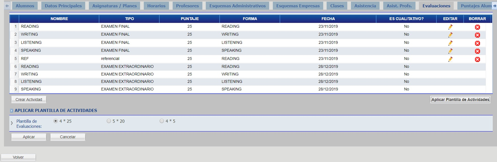

# Evaluaciones

Para ver la lista de evaluaciones haga click en la pestaña "Evaluaciones".

## Crear Evaluacion

Haga click en el botón "Crear Actividad", complete los campos y haga click en el botón "Guardar".

_Observación: utilizar esta opción para agregar evaluaciones en forma individual. Si quiere agregar todas las evaluciones de un curso de una sola vez, vea el apartado posterior @ref:[Plantillas de Evaluaciones](#aplicar-plantilla)_

## Editar Evaluacion

Haga click en el botón con ícono de "Lápiz", correspondiente a la evaluación a modificar.

Modifique los campos que desee y haga click en el botón "Guardar".

## Borrar Evaluacion

Haga click en el botón con ícono "X" ubicado en la columna "Borrar" correspondiente a la evaluación a ser borrada.

Haga click en el botón "Si" para confirmar la operación.

## Aplicar Plantilla

Haga click en el botón "Aplicar Plantilla de Actividades", complete los campos y haga click en el botón "Aplicar".

Sirve para pre-cargar las evaluacion de un curso, las opciones:

   * 4*25: Crear 4 evaluaciones de 25 puntos cada uno.
   * 5*20: Crea 5 evaluaciones de 20 puntos cada una.
   * 4*5: Crea 4 evaluaciones de 5 puntos cada una (para cursos de Young Learners).
   * No crear: No crea ninguna evaluación, las mismas luego se pueden agregar en la pestaña @ref:[Evaluaciones](#evaluaciones).
