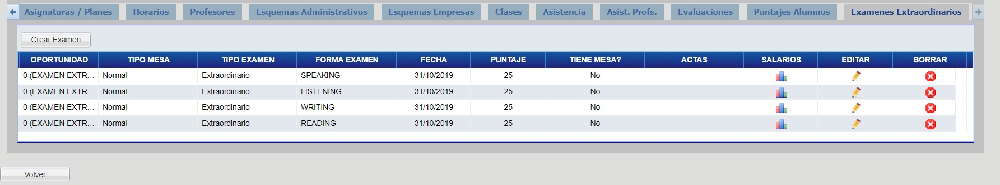
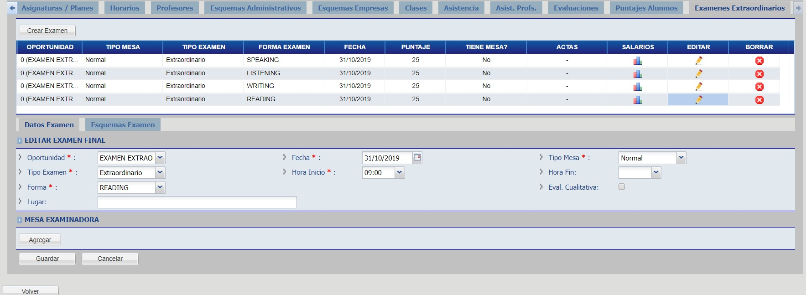
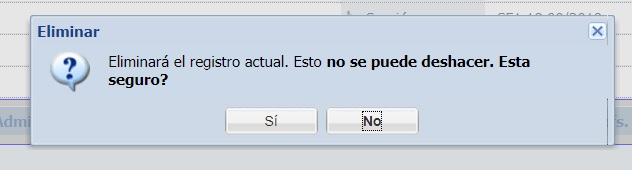
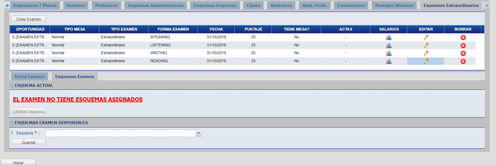

# Examenes Extraordinarios

Para ver los exámenes extraordinarios, haga click en la pestaña "Examenes Extraordinarios".

## Crear Extraordinario

Para crear un examen extrardinario haga click en el botón "Crear Examen".

Complete los campos del formulario y haga click en el botón "Guardar".

## Editar Extraordinario

Haga click en el botón con ícono de "Lápiz", correspondiente al exámen extraordinario a modificar. Modifique los campos y haga click en el botón "Guardar".

## Borrar Extraordinario

Para borrar un examen extrardinario haga click en el botón con ícono "X" ubicado en la columna "Borrar" correspondiente al extraordinario que desee borrar.

Haga click en el botón "Si" para confirmar la operación.

## Asignar Esquema

Haga click en el botón con ícono de "Lápiz", correspondiente al exámen extraordinario a modificar. Seguidamente, haga click en la pestaña "Esquemas Examen".

Eliga un esquema para dicho examen y haga click en el botón "Guardar".

