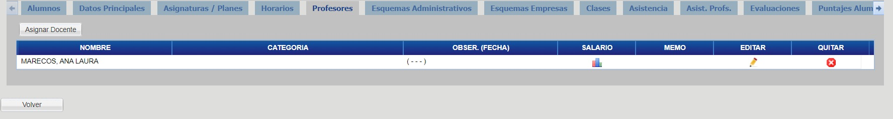
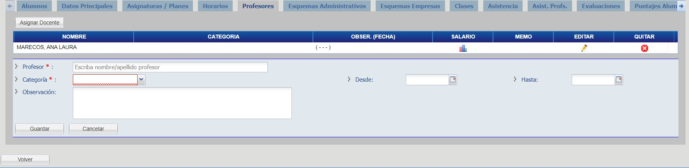

# Profesores

Haga click en la pestaña "Profesores" para visualizar los profesores del curso.

## Asignar Docente

Para asignar un profesor haga click en el botón "Asignar Docente", complete los campos y haga click en el botón "Guardar".

_Observación: Al agregar un nuevo profesor, si el mismo es el principal del curso utilizar la categoria “Principal”, y deje las fechas vacias._

En caso de querer agregar un profesor reemplazante (que haya reemplazado al Principal en una o más clases especificas), agregue al mismo utilizando la categoria “Reemplazante” indicando en las fechas, las fechas del reemplazo (desde - hasta).
Puede agregar varios reemplazantes, o a un mismo profesor reemplazante mas de una vez de acuerdo a las necesidades.
