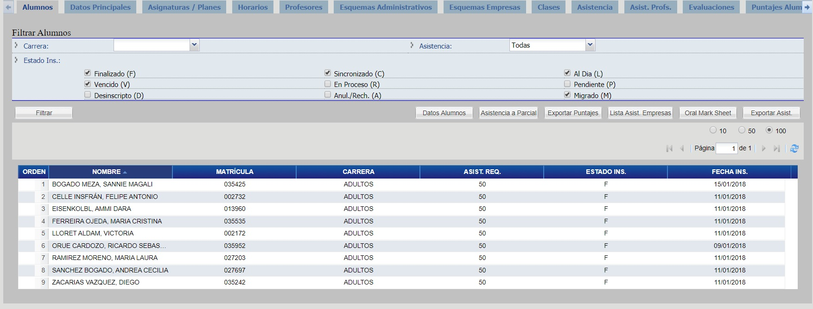
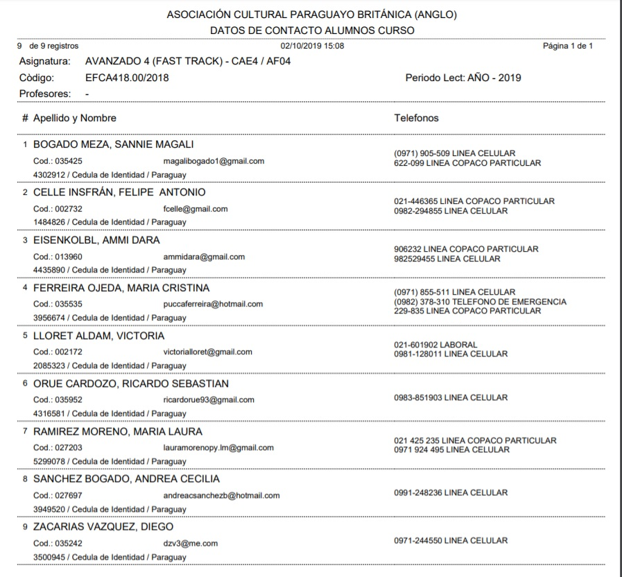
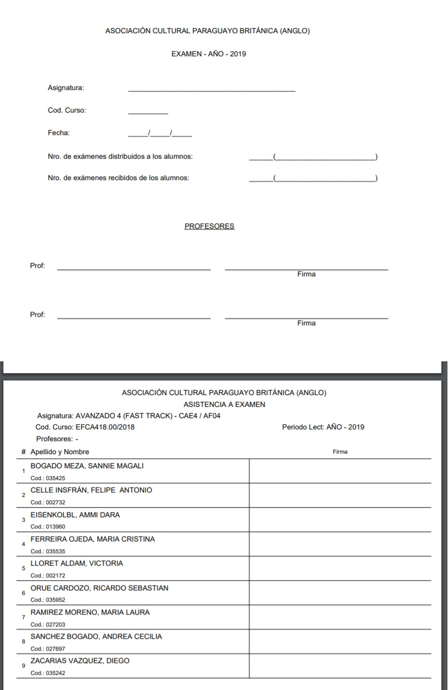
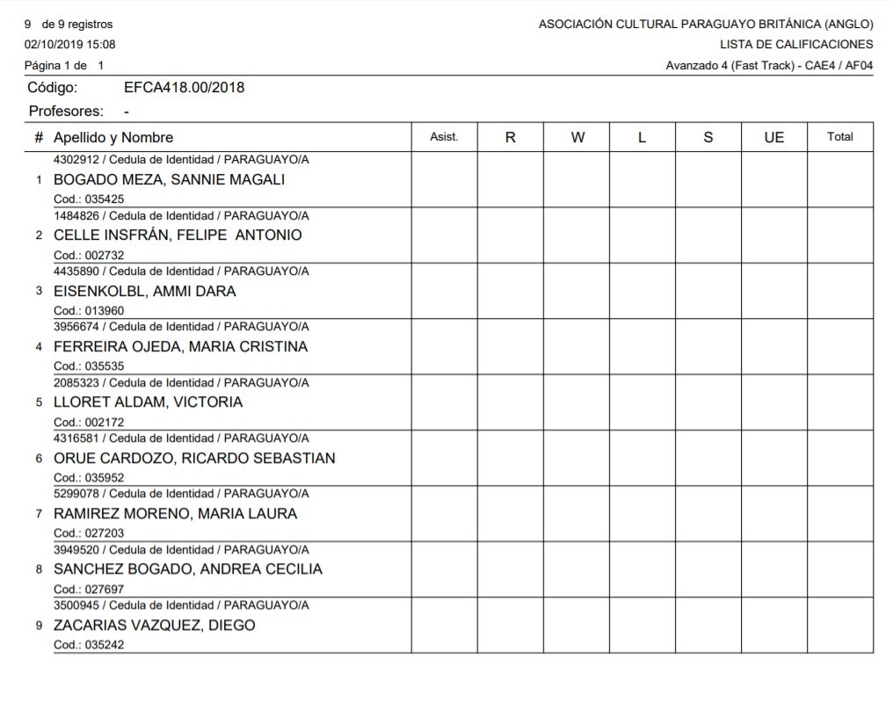
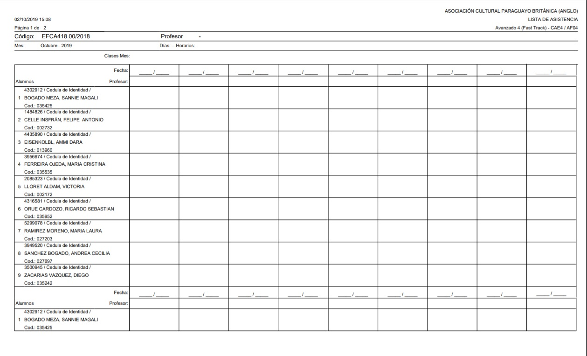
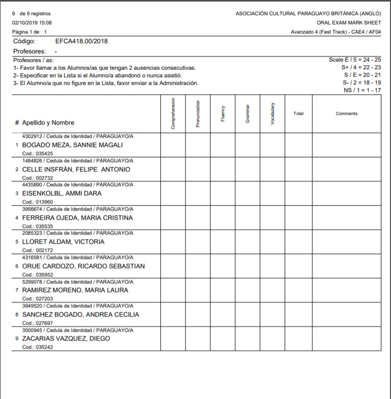
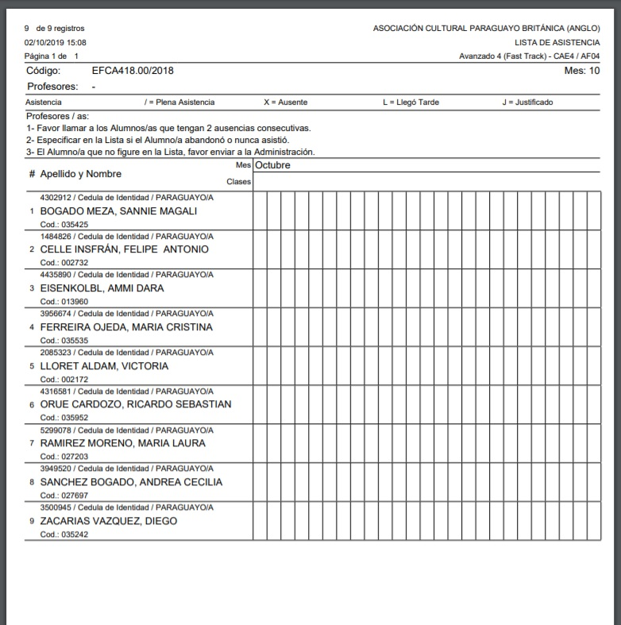

# Alumnos

Los reportes que se pueden generar son:

_Observación: los reportes se generan en función al filtro de alumnos aplicado._

## Datos Alumnos

Haga click en el botón "Datos Alumnos" y elija el formato a exportar.

Se le presentará el siguiente reporte:

## Asistencia a Parcial

Haga click en el botón "Asistencia a Parcial" y elija el formato a exportar.

 
Se le presentará el siguiente reporte:

## Exportar Puntajes

Haga click en el botón "Exportar Puntajes" y elija el formato a exportar.

Se le presentará el siguiente reporte:

## Lista Asist. Empresas

Haga click en el botón "Lista Asist. Empresas" y elija el formato a exportar.

Se le presentará el siguiente reporte:

## Oral Mark Sheet

Haga click en el botón "Oral Mark Sheet" y elija el formato a exportar.

Se le presentará el siguiente reporte:

## Exportar Asist.

Haga click en el botón "Exportar Asist." y elija el formato a exportar.

Se le presentará el siguiente reporte:

