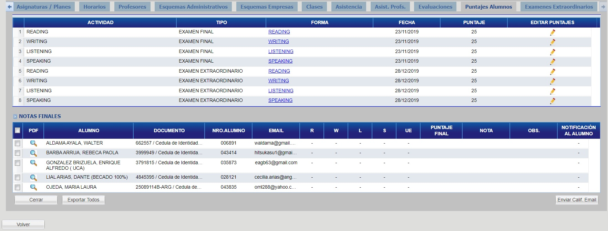
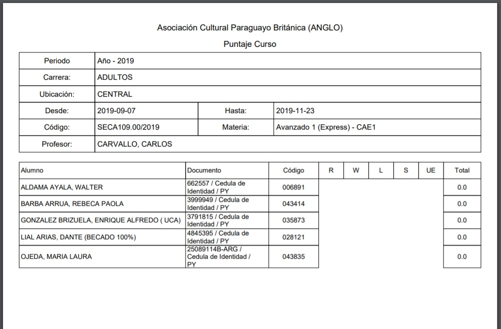
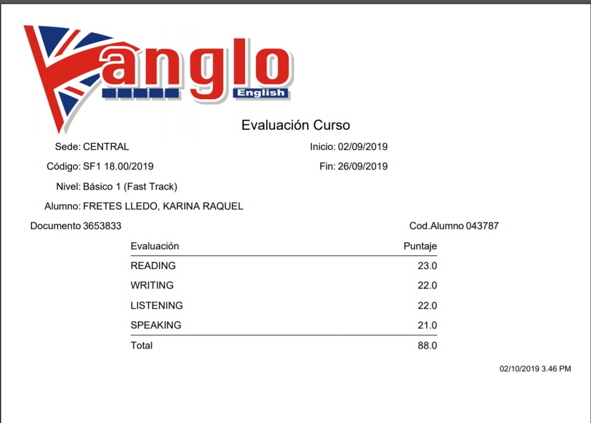

# Puntajes Alumnos

## Puntajes del Curso

Para exportar los puntajes del curso haga click en el botón "Exportar Todos"

Seguidamente, se generará el siguiente reporte:

## Puntajes un Alumno

Para exportar los puntajes del curso haga click en el botón con ícono de "Lupa" correspondiente al alumno deseado.

Seguidamente, se generará el siguiente reporte:

