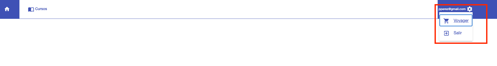
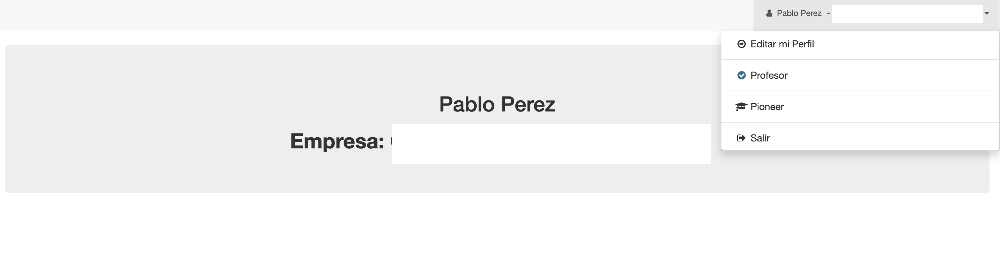
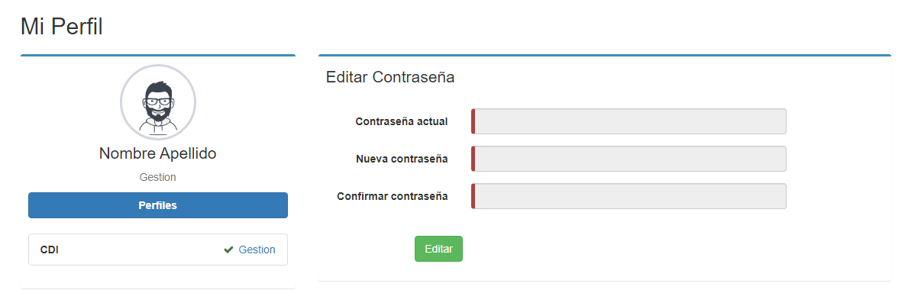
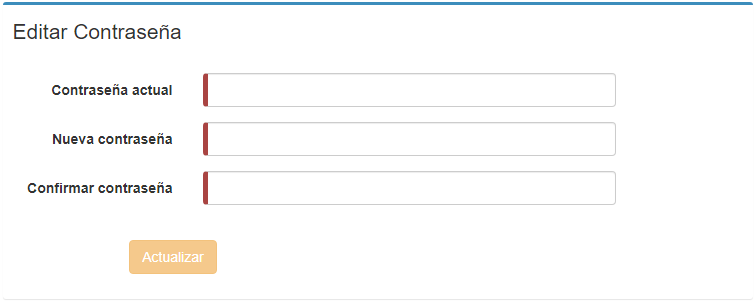
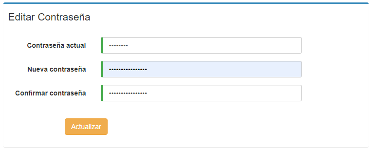

# Cambio de contraseña
Para realizar un cambio de contraseña, se debe navegar al sistema Voyager.
Desplegar el menú de opciones de Pioneer haciendo clic en nuestro perfil, situado en la esquina superior derecha, y luego
click en Voyager:

Luego el sistema lleva al usuario a la pantalla principal de Voyager, donde de nuevo
click en esquina superior derecha:

Seleccionamos la opción **Editar mi perfil**, el sistema nos mostrará la visualización del perfil:

Presionamos el botón **Editar**:

Una vez se vea el formulario de esta manera, debemos ingresar nuestra contraseña actual y la nueva contraseña, esta última tenemos que escribirla dos veces.

Al finalizar, hacemos clic en **Actualizar**.

El sistema mostrará un mensaje que nos confirmará que la contraseña ha sido cambiada correctamente:

