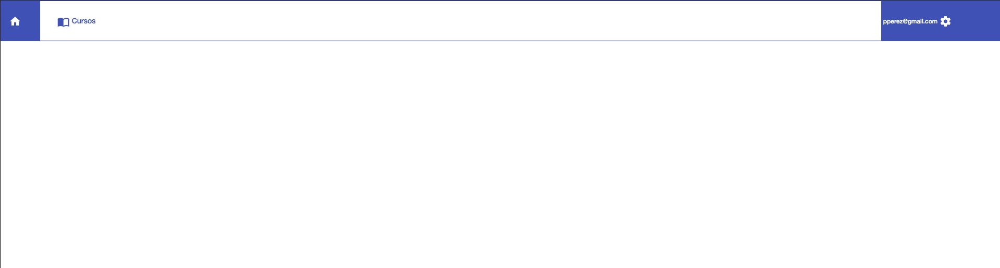
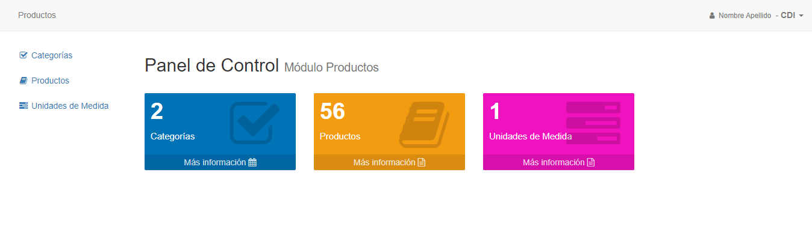

# Ingreso al sistema

## Cómo ingresar

Para ingresar al sistema, debemos pasar primero por la pantalla de [Login](http://181.126.82.164:9000/):

Una vez allí, ingresamos el usuario (correo electrónico) y la contraseña correspondiente:

Después de hacer clic en el botón **Ingresar**, el sistema nos conduce a la página de Inicio:

En el centro de la página se muestran el nombre de usuario y el nombre de la empresa.
En la parte de arriba a la izquierda se observan las pestañas.
En la esquina superior derecha se observa el nombre de usuario, que se puede cliquear para desplegar un menú de opciones:

*Aclaración: Si se está visitando la página desde un terminal más pequeño (o si se disminuye el tamaño de la ventana), el aspecto puede ser diferente:*

*En este caso, para tener acceso a las pestañas y al menú de opciones, se requiere hundir el botón con tres líneas, situado en la esquina superior derecha:*

## Navegación

Una vez estemos ingresados, podremos acceder a las pestañas del sistema. En este caso, haremos clic en la pestaña **Productos**:

El sistema nos llevará al menú principal de **Productos**, donde podemos ver las secciones y la cantidad de registros ingresados en cada una de ellas:

En la imagen se pueden ver tres secciones:

* Categorías
* Productos
* Unidades de medida

Todas y cada una de estas secciones puede ser accedida seleccionando su recuadro central correspondiente o haciendo clic sobre su nombre en la lista de la izquierda:

*En la imagen observamos las opciones disponibles para entrar a la sección de Categorías*

Al hacer clic en cualquiera de estas dos opciones, se mostrará la interfaz correspondiente a la sección:

*Imagen de la sección de Categorías*

Podemos desplazarnos entre las secciones cliqueando la sección deseada en el índice de la izquierda:
