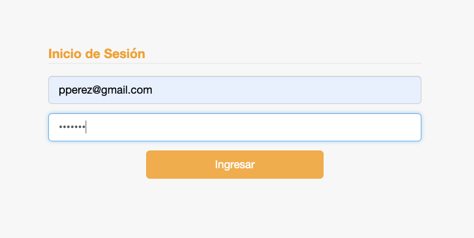

# Ingreso al sistema

## Cómo ingresar

Para ingresar al sistema, debemos pasar primero por la pantalla de [Login](https://cele.espy.cloud):

Una vez allí, ingresamos el usuario (correo electrónico) y la contraseña correspondiente:

Después de hacer clic en el botón **Ingresar**, el sistema nos conduce a la página de Inicio del sistema académico Pioneer:

En la parte de arriba a la izquierda el menú de navegación.
En la esquina superior derecha se observa el nombre de usuario, que se puede cliquear para desplegar un menú de opciones:

* Voyager - Para ir al sistema administrativo.
* Salir - Para salir del sistema y cerrar sesión.

El sistema está compuesto de dos subsistemas:

* Pioneer, para la gestión académica.
* Voyager, para la gestión administrativa.

Un profesor, va a utilizar mayormente el sub-sistema Pioneer. Donde va a poder gestionar sus cursos.

## Navegación

Una vez estemos ingresados, podremos acceder a las funcionalidades del sistema utilizando el menú superior.
El menú superior, muestra los módulos habilitados para el usuario del sistema. Si hacemos click en el módulo, se muestra un
submenú con las funcionalidades del módulo. Luego podemos hacer click sobre cada funcionalidad para utilizarla.

Por ej: Si hacemos click en el módulo Cursos, se despliegan sus funcionalidades:

* Mantener Cursos
* Asistencias

Luego hacemos click en la funcionalidad que queremos utilizar.
Por ej. si vamos a utilizar Mantener Cursos, al hacer click. Se muestra la interface en la 
sección principal:

Podemos desplazarnos entre las funcionalidades cliqueando la sección deseada:

