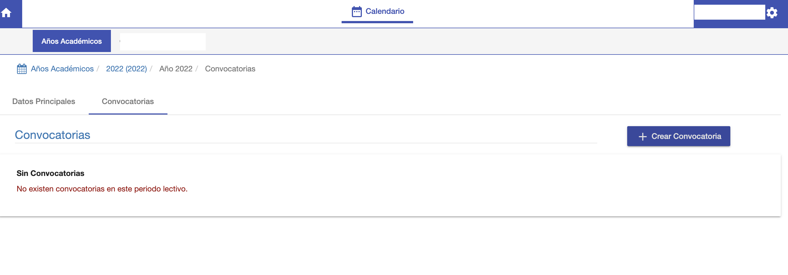
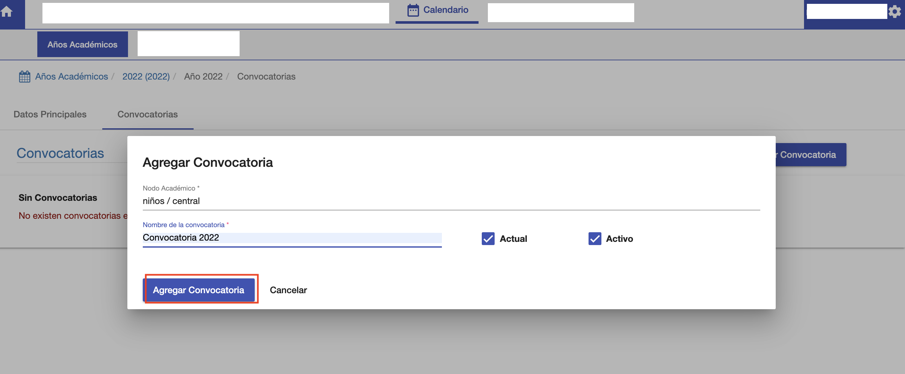
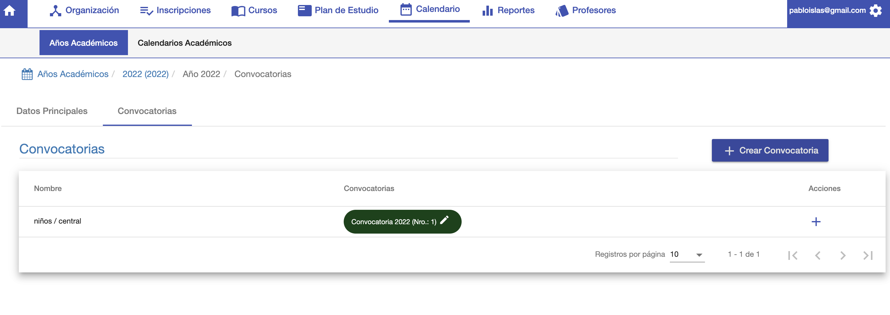

#Convocatorias

Una convocatoria habilita a la inscripción de los alumnos
en un periodo lectivo a una carrera.
Es decir, se debe crear una convocatoria para un Periodo Lectivo/Carrera/Sede
para habilitar inscripciones.

##Listado de convocatorias
Cada periodo lectivo tiene una pestaña de convocatorias. Donde se listan
las convocatorias ya creadas para las Carrera/Sede.

##Crear Convocatoria
Para crear una convocatoria hacer clic en el botón *+Crear Convocatoria*, y se despliega
la  ventana Agregar Convocatoria:

*Nodo Académico*: Elegir la Carrera/Sede para la convocatoria.
*Nombre de la Convocatoria*: Nombre para diferenciar a la convocatoria.
*Actual*: Para indicar que es la convocatoria en curso.
*Activo*: Para indicar que la convocatoria se puede utilizar, está habilitada para inscripciones.

Luego de completar los campos hacer clic en el botón *Agregar Convocatoria* y el sistema crea la convocatoria
y la muestra en la grilla de convocatorias del periodo lectivo.

