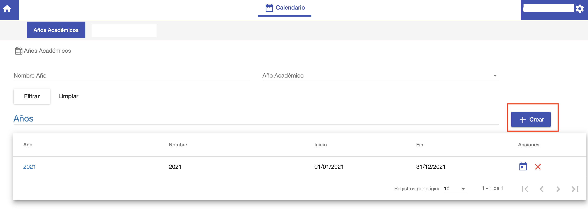
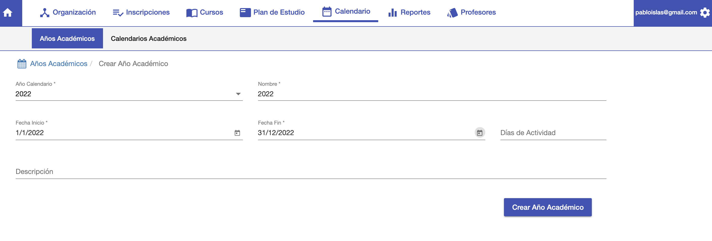
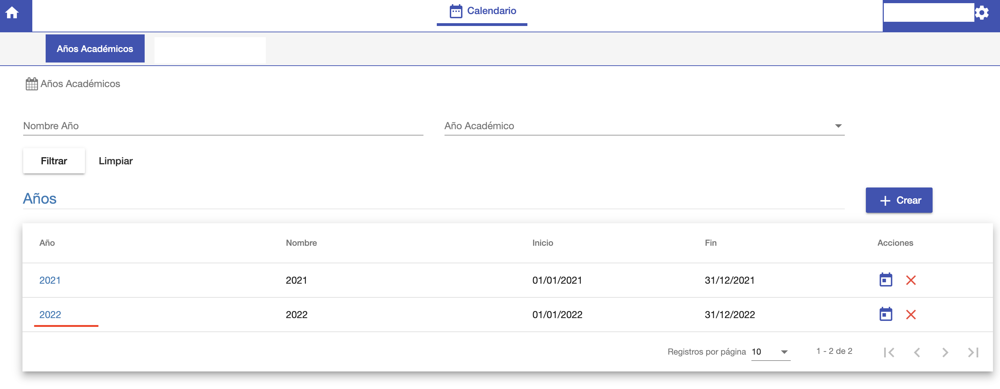

#Crear Año Académico

Para crear un año académico, ir al listado de años academicos y hacer clic en el botón
*+ Crear*.

Se despliega la interfaz para crear un Año Académico con los siguientes datos:

- *Año Calendario*: Se elije el año del calendario.
- *Nombre*: Se completa el nombre para identificar al año académico. Se puede
utilizar el mismo nombre que el año calendario.
- *Fecha Inicio*: Fecha en que inician las actividades académicas.
- *Fecha Fin*: Fecha en que finalizan las actividades académicas.
- *Dias de Actividad*: Campo opcional, para registrar la cantidad de días del año académico.
- *Descripción*: Campo opcional, para registrar un comentario u observación.

Luego de completar los campos, clic en *Crear Año Académico*. Se crea el año y el sistema
muestra la grilla de años incluyendo el nuevo año creado.

