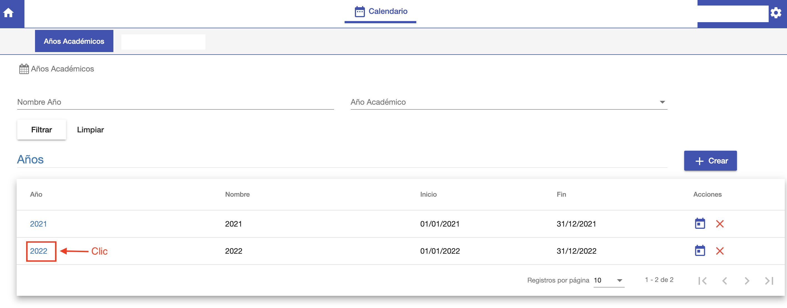
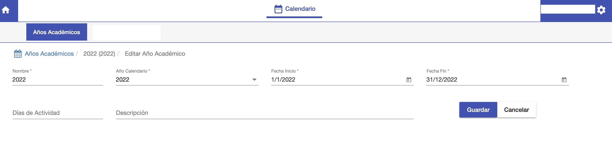

#Editar Año Académico

Para editar un año académico, ir al listado de años académicos y hacer clic en el enlace
del año académico que se desea editar.

Se despliega una interfaz donde:

- Se muestran los datos del periodo. Que pueden editarse.
- Se muestra una grilla con los periodos lectivos del año.

Para editar los datos del año académico, clic en Editar y se habilita la sección
con los datos para editar.

Se puede modificar los datos y luego hacer clic en Guardar para confirmar los cambios o Cancelar
para no realizar los cambios.

