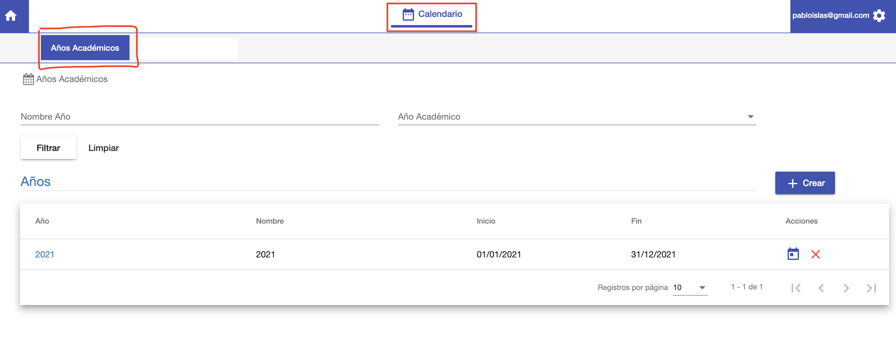

# Años Académicos

@@toc
@@@ index
* [Crear Año Académico](crear.md)
* [Editar Año Académico](editar.md)
* [Periodos Lectivos](periodos_lectivos.md)
* [Convocatorias](convocatorias.md)
@@@

Los periodos académicos que se deben manejar son:

- Año Académico. Para definir cada año de actividad académica.
- Periodo Lectivo. Un año académico debe estar compuesto por los periodos lectivos. Semestres, Trimestres etc. Los
  cursos se asignan a periodos lectivos.
- Convocatoria. Las convocatorias son periodos de inscripiones a los periodos lectivos.

Para ingresar a esta funcionalidad, ingresar al módulo *Calendario* y luego hacer clic en la opción *Años Académicos*.

Se despliega una interfaz con el listado de los Años Académicos.
En esta interfaz se puede:

- *Listar y buscar Años Académicos*.
- *Crear Año académico*.
- *Editar Año Académico*.
- *Borrar Año Académico*

##Listado
La interfaz despliega una grilla con los años académicos ya creados.
Cada año se muestra con sus datos:

 - *Año*: Año de calendario asignado al año académico.
 - *Nombre*: Nombre del año académico.
 - *Inicio*: Fecha de inicio del año académico.
 - *Fin*: Fecha de fin del año académico.

Se ofrecen dos filtros de búsqueda:
 - *Nombre*: Para buscar años académicos por nombre.
 -*Año Académico*: Para buscar años por año calendario.

Luego de completar los filtros, hacer en clic en *Filtrar*, para mostrar
los resultados en la grilla. Clic en Limpiar para restablecer el listado.

