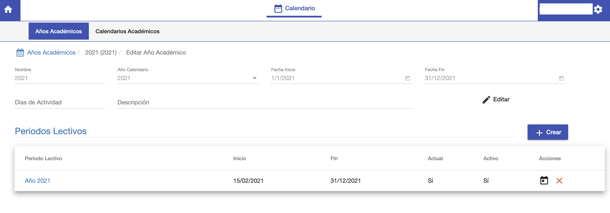
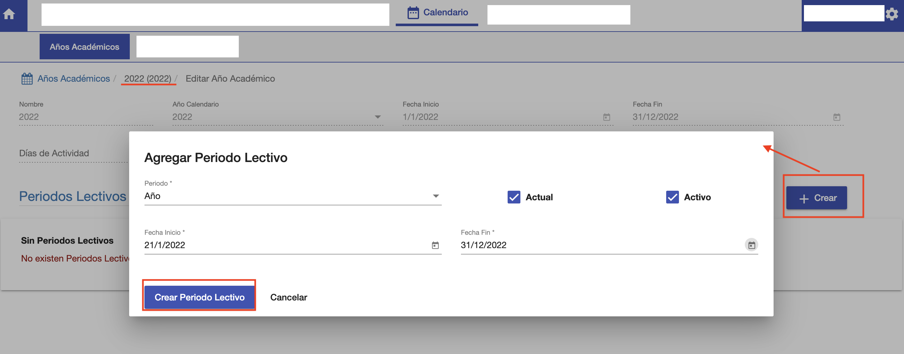
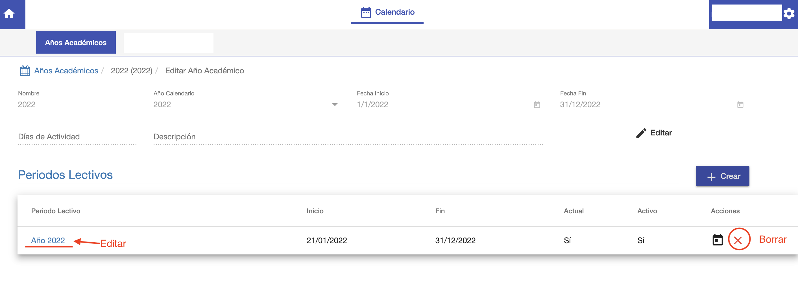
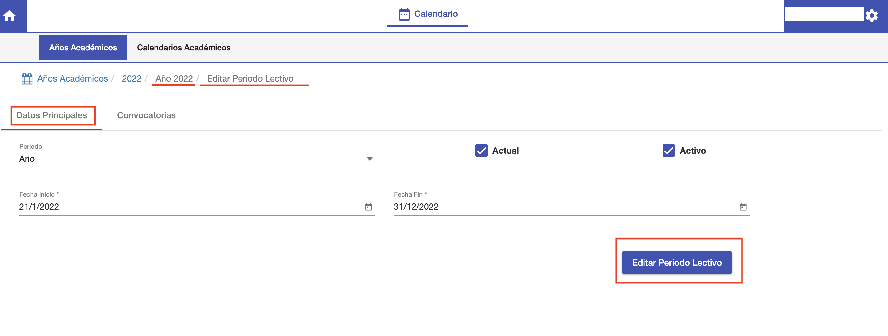

#Periodos Lectivos

Los periodos lectivos son los periodos académicos que componen
un año académico.

En cada periodo lectivo se pueden habilitar cursos.
Por ejomplo, el año académico 2022 puede tener dos periodos lectivos semestrales.
Semestre 1 y Semestre 2. En Semestre 1 se puede habilitar un curso de Ingles 1 y en Semestre 2
se habilita un curso de Ingles 2.

##Listado de periodos lectivos
Los periodos lectivos corresponden a un año académico. Entonces ingresar al año académico y se obtiene
el listado de sus periodos lectivos.

En el ejemplo de Stael, se utiliza un periodo lectivo anual. Ya que los cursos se abren y tienen
una duración anual.

##Crear Periodo Lectivo
Para crear un periodo lectivo hacer clic en el botón *+Crear*, que se encuentra dentro
del año académico. Se despliega la interfaz para crear un periodo.

Donde se completan los siguientes campos:

*Periodo*: Se elije el tipo de periodo. Que puede ser: Año, 1er Semestre, 2do Semestre etc.
*Fecha Inicio*: Fecha de inicio de actividades del periodo.
*Fecha Fin*: Fecha de fin de actividades del periodo.
*Actual*: Indica si es el periodo en curso o actual. Si es actual se muestra de manera predeterminada en el sistema.
*Activo*: Indica si el periodo está activo para su uso. Crear Curso, Inscripciones etc.

Clic en *Crear Periodo Lectivo* para guardar el periodo dentro del año académico.
Luego de crear el periodo, éste aparece en la grilla de Periodos Lectivos del Año Académico.

Esta grilla puede utilizarse para Borrar el periodo o acceder al periodo para editarlo.

##Editar Periodo Lectivo
Para editar un periodo lectivo, clic en el enlace del periodo lectivo y se despliega
la interfaz del periodo lectivo.

La pestaña de Datos Principales permite editar lo datos del periodo.
La pestaña Convocatorias permite registrar las Convocatorias del periodo lectivo.
