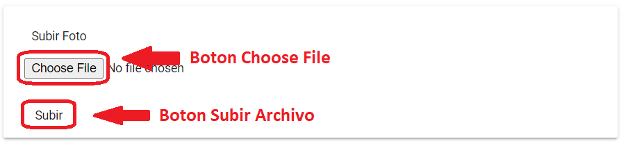

# Cliente

En esta pestaña se habilita la interface de edición de los *Datos Cliente* y los de *Inscripción*, los datos requeridos obligatoriamente tienen un asterisco (*):

~~~
LOS CAMBIOS REALIZADOS EN ESTA PESTAÑA AFECTAN AL CLIENTE QUE TOMARA EL CURSO.
~~~

### Datos Cliente

-	*Nombres**: campo para edición del nombre del *alumno/cliente*.
-	*Apellidos**: campo para edición del apellido del *alumno/cliente*.
-	*Documento*: campo para edición del número de documento a asignado.
-	*Tipo de Documento*: lista desplegable para seleccionar y editar el tipo de documento.
-	*Fecha de Nacimiento*: campo para edición de la fecha de nacimiento del *alumno/cliente*.
-	*Dirección*: campo para edición de la dirección particular de residencia del *alumno/cliente*.
-	*Teléfono*: campo para editar el número de teléfono o línea de celular para contacto de *alumno/cliente*.
-	*Correo*: campo para editar el correo electrónico para contacto de *alumno/cliente*.

### Inscripción.

En esta interface se podrán ver los cursos a los cuales se ha inscripto el *alumno/cliente*.  

Al final de la interface de edición tenemos los botones para *Inscripción*, *Asociar Inscripción*, *Editar Cliente*, *Quitar Cliente* y *Asociar Nuevo Cliente*.  

El botón * Inscripción *: despliega una ventana con la grilla *Buscar Cursos* para *Inscripción* del alumno.  Una vez asignado un *Curso* al *alumno/cliente* el estado de la oportunidad pasa a *Finalizado*.

Campos de la grilla *Buscar Cursos*: 

1.	*Asignatura*: lista de las asignaturas disponibles.
2.	*Plan*: campo que describe el tipo de plan asociado a la asignatura.
3.	*Convocatoria*: campo que lista el calendario académico.
4.	*Cursos/Turno*: campo que lista un curso y su horario.
5.	*Profesor*: campo que lista el profesor disponible.
6.	*Horario*: campo donde se verifica los horarios de curso.
7.	*Alumno*: campo que lista la cantidad de alumnos por asignatura.

El botón *Asociar Inscripción*: despliega una ventana con la grilla para *Buscar Inscripciones* anteriores del *alumno/cliente*.  Una vez asignado un *Curso* al *alumno/cliente* el estado de la oportunidad pasa a *Finalizado*.
Campos de la grilla *Buscar Inscripciones*:

1.	*Asignatura*: lista de las asignaturas disponibles.
2.	*Plan*: campo que describe el tipo de plan asociado a la asignatura.
3.	*Convocatoria*: campo que lista el calendario académico.
4.	*Nivel*: campo que lista un curso y su horario.
5.	*Horario*: días y horas en que se realizan las clases.

El botón *Editar Cliente*: permite guardar los cambios realizados en la edición.  
El botón *Quitar Cliente*: permite eliminar el cliente asociado al cliente principal.  
El botón *Asociar Nuevo Cliente*: permite asociar nuevos clientes al cliente principal, despliega una nueva interface de *Datos de Cliente*.  
El botón *Asociar Cliente*: confirma el nuevo cliente y lo asocia al cliente principal.  

### Añadir fotografía a perfil de Oportunidad

A la derecha de los datos personales tenemos en recuadro las opciones para añadir una foto al perfil si fuese necesario.

1.	Botón *Choose File*: muestra una caja de texto donde el usuario debe especificar la ruta del archivo que se encuentra en el ordenador del usuario y que será enviado al servidor.  
2.	Botón *Subir*: el archivo es enviado al servidor y se muestra en el perfil de la Oportunidad.
