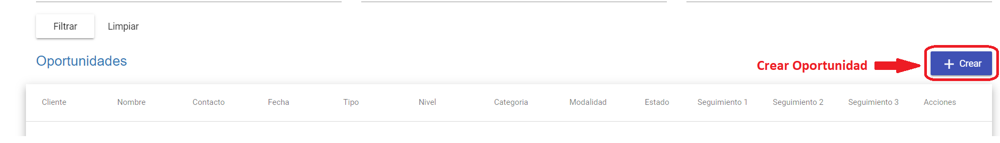
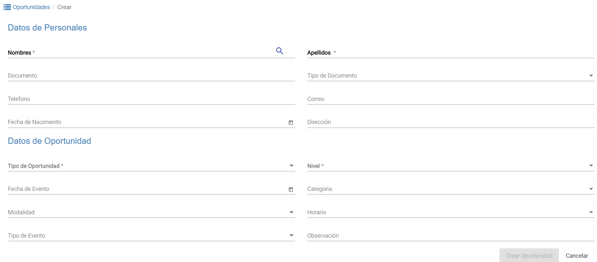
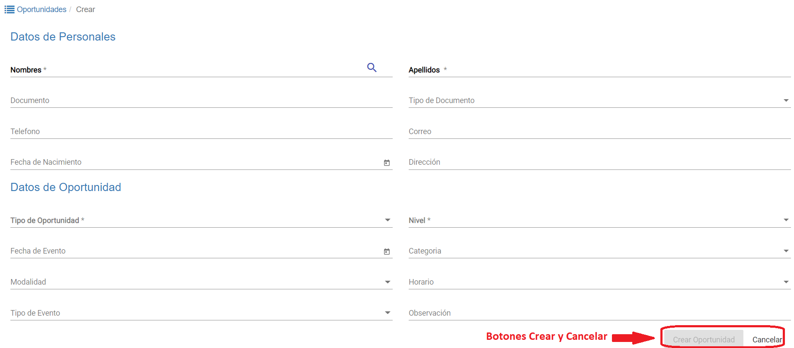

# Crear Oportunidad

Para crear una nueva oportunidad hacer clic en el botón *+Crear*, que se encuentra sobre la esquina superior izquierda de la grilla de oportunidades.

Se habilitan dos interfaces donde se pueden completar los *Datos Personales* y los *Datos de Oportunidad*, los datos requeridos obligatoriamente estan en **negrita** y tienen un asterisco (*):

### Datos Personales

-	*Nombres**: nombres a asignar a la oportunidad *alumno/cliente*.
-	*Apellidos**: apellidos a asignar a la oportunidad *alumno/cliente*.
-	*Documento*: número de documento a asignar a la oportunidad
-	*Tipo de Documento*: lista desplegable para seleccionar tipo de documento.
-	*Teléfono*: número de teléfono o línea de celular para contacto de *alumno/cliente*.
-	*Correo*: correo electrónico para contacto de *alumno/cliente*.
-	*Fecha de Nacimiento*: fecha de nacimiento del *alumno/cliente*.
-	*Dirección*: dirección particular de residencia del *alumno/cliente*.

### Datos de Oportunidad

-	*Tipo de Oportunidad**: lista desplegable para seleccionar el tipo de *oportunidad*.
-	*Nivel**: lista desplegable para seleccionar el nivel de inglés que posee el *alumno/cliente*.
-	*Fecha de Evento*: fecha en que se registra la oportunidad.
-	*Categoría*: lista desplegable para seleccionar y asignar una categoría a la oportunidad.
-	*Modalidad*: lista desplegable para seleccionar modalidad de estudio (virtual o presencial).
-	*Horario*: lista desplegable para seleccionar los distintos horarios disponibles para inscripción.
-	*Tipo de Evento*: lista desplegable para seleccionar que tipo de contacto se tuvo con el cliente para registrar en la oportunidad.
-	*Observación*: campo para registrar cualquier tipo de comentario con relación a la oportunidad creada.

Una vez completados todos los datos necesarios se registran o se eliminan los datos con los botones **Crear Oportunidad** o **Cancelar**.  

