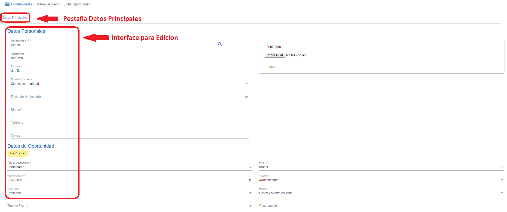
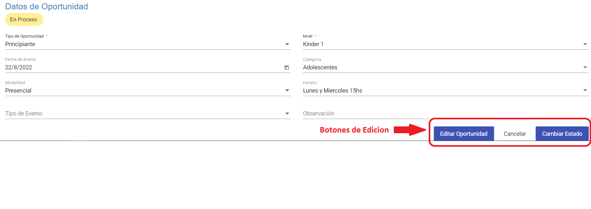
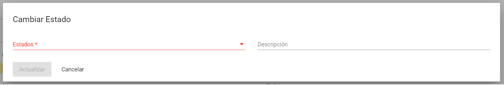
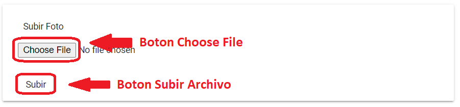

# Datos Principales

En esta pestaña se habilitan dos interfaces de edición de los *Datos Personales* y los *Datos de Oportunidad*, los datos requeridos obligatoriamente tienen un asterisco (*):

### Datos Personales
-	*Nombres**: campo para edición del nombre del *alumno/cliente*.
-	*Apellidos**: campo para edición del apellido del *alumno/cliente*.
-	*Documento*: campo para edición del número de documento asignado.
-	*Tipo de Documento*: lista desplegable para seleccionar y editar el tipo de documento.
-	*Fecha de Nacimiento*: campo para edición de la fecha de nacimiento del *alumno/cliente*.
-	*Dirección*: campo para edición de la dirección particular de residencia del *alumno/cliente*.
-	*Teléfono*: campo para editar el número de teléfono o línea de celular para contacto de *alumno/cliente*.
-	*Correo*: campo para editar el correo electrónico para contacto de *alumno/cliente*.

### Datos de Oportunidad

-	*Tipo de Oportunidad**: lista desplegable para editar el tipo de *oportunidad*.
-	*Nivel**: lista desplegable para editar el nivel de inglés que posee el *alumno/cliente*.
-	*Fecha de Evento*: campo para editar la fecha en que se registró la oportunidad.
-	*Categoría*: lista desplegable para editar y asignar una categoría diferente a la oportunidad.
-	*Modalidad*: lista desplegable para editar la modalidad de estudio (virtual o presencial).
-	*Horario*: lista desplegable para editar los distintos horarios disponibles para inscripción.
-	*Tipo de Evento*: lista desplegable para editar que tipo de contacto se tuvo con el cliente para registrar en la oportunidad.
-	*Observación*: campo para editar un comentario realizado con relación a la oportunidad que se  creó.

Al final de la interface de edición tenemos los botones para *Editar Oportunidad*, *Cancelar* y *Cambiar Estado*  

El botón *Editar Oportunidad*: permite guardar los cambios realizados en la edición.

El botón *Cancelar*: permite anular o dejar sin efecto la edición realizada a la Oportunidad.

El botón *Cambiar Estado*: despliega una ventana de edición del estado actual con los siguientes campos editables: 

1. *Estados**: lista desplegable con los diferentes tipos de estados disponibles.
1. *Descripción*: campo editable para agregar comentarios sobre el cambio de estado.
2. *Botones de Actualizar o Cancelar*: para guardar o deshacer los cambios realizados.  

### Añadir fotografía a perfil de Oportunidad

A la derecha de los datos personales tenemos en recuadro las opciones para añadir una foto al perfil si fuese necesario.  

1.	Botón *Choose File*: muestra una caja de texto donde el usuario debe especificar la ruta del archivo que se encuentra en el ordenador del usuario y que será enviado al servidor.

2.	Botón *Subir*: el archivo es enviado al servidor y se muestra en el perfil de la Oportunidad.
