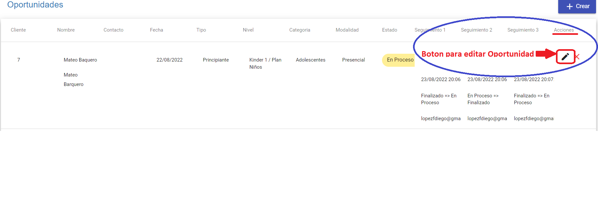
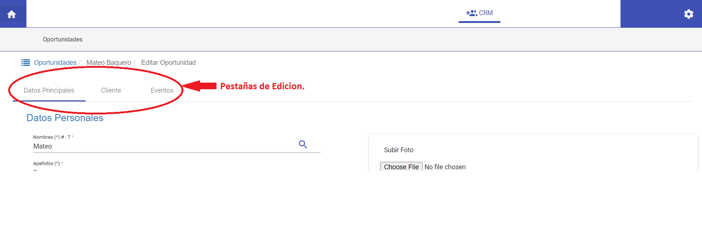

# Editar Oportunidad

@@@index
* [Datos Principales](datos_principales.md)
* [Cliente](cliente.md)
* [Eventos](eventos.md)
@@@

En la grilla de *Oportunidades*, en la columna de *Acciones*, por cada oportunidad puede realizar las ediciones haciendo click en el botón *Editar Oportunidad* que nos permitirá acceder a las interfaces de edición de oportunidades.

En la parte superior de la interface de edición, podemos acceder a las pestañas de edición de: *Datos Principales*, *Cliente* y *Eventos*.

