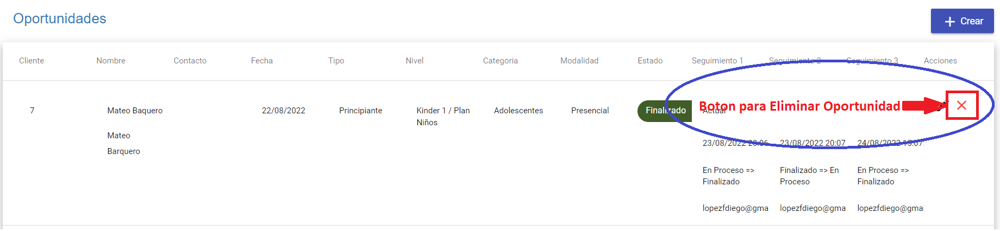

# Eliminar Oportunidad
El botón *Borrar Oportunidad* elimina las oportunidades creadas con estado “en proceso”, las oportunidades con estado más avanzado ya no podrán ser eliminados con este método.

