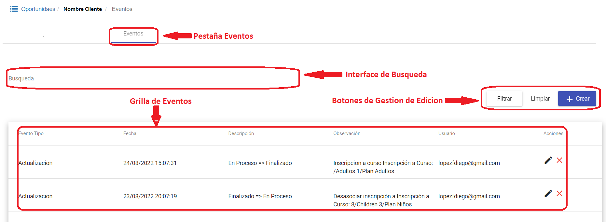
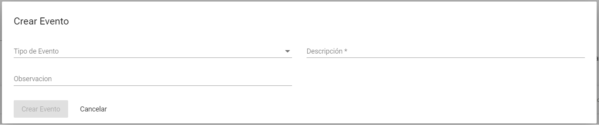
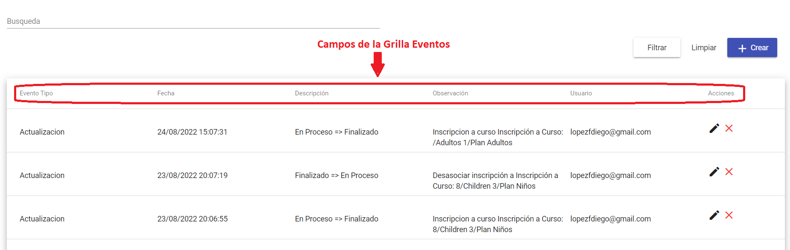
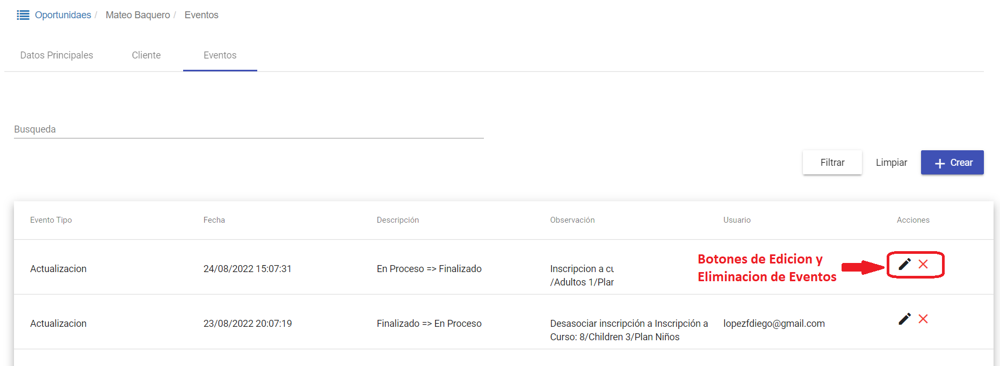
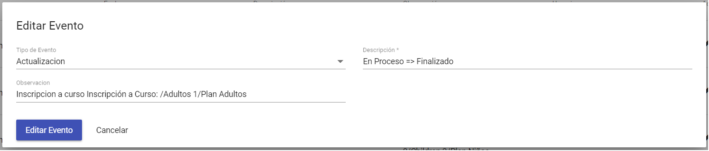

# Eventos

En esta pestaña se habilita una interface de búsqueda de *Eventos*, con sus respectivos botones de *Filtrar*, *Limpiar* y *+Crear*.

Se despliega también la grilla de *Eventos*.

Con los botones de *Filtrar* y *Limpiar* se realizan las acciones que se reflejan en la grilla, filtrar para mostrar los resultados en la grilla y limpiar para reestablecer los criterios de búsqueda.

Con el botón *+Crear* se genera una nuevo evento: se despliega una ventana de edición para *Crear Evento* con los siguientes  campos editables: 

1.	*Tipo de Evento*: lista desplegable con los diferentes tipos de eventos disponibles.
2.	*Descripción**: campo editable para agregar comentarios sobre la creación del evento.
3.	*Observación*: campo editable para detallar el tipo de inscripción para el nuevo evento.
4.	*Botones de Crear Evento o Cancelar*: para guardar o deshacer los cambios realizados.

Campos de la grilla *Eventos*: 

1.	*Evento Tipo*: contiene los datos de Tipo de Evento.
2.	*Fecha*: contiene la fecha y la hora del evento.
3.	*Descripción*: contiene los datos del estado en el que se encuentra el evento.
4.	*Observación*: campo que describe el proceso de inscripción (curso y plan).
5.	*Usuario*: campo que lista el usuario responsable de la carga del evento.
6.	*Acciones*: la columna de acciones para cada evento cuenta con dos botones, uno para edición de datos, botón *Editar Evento* y otra para borrado de estos eventos, botón *Eliminar Evento*.

-	Botón *Editar Evento*: despliega la ventana *Editar Evento* con una interface para edición de eventos con los siguientes  campos editables:  

    - *Tipo de Evento*: lista desplegable con los diferentes tipos de eventos disponibles.  
    - *Descripción**: campo editable para agregar comentarios sobre la creación del evento.  
    - *Observación*: campo que detalla el tipo de inscripción asociada al evento.  
    - *Botones de Editar Evento o Cancelar*: para guardar o deshacer los cambios realizados.

-	Botón *Eliminar Evento*: elimina la fila del evento seleccionado.
