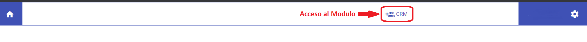
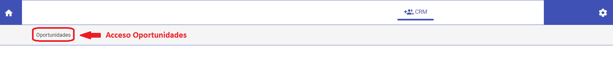
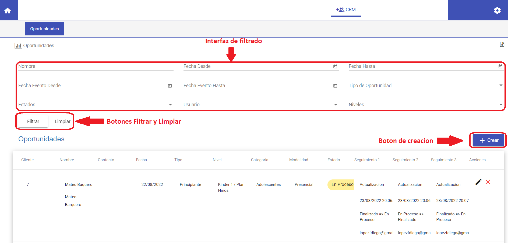
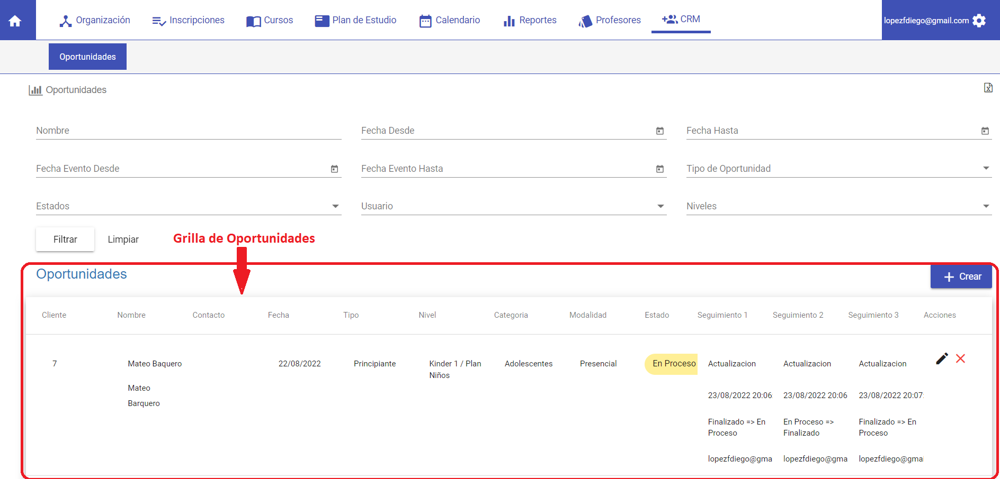

# CRM

@@toc
@@@index
* [Crear una nueva Oportunidad](crear_oportunidad.md)
* [Editar una Oportunidad](editar_oportunidad.md)
* [Eliminar una Oportunidad](eliminar_oportunidad.md)
@@@

**El módulo CRM se utiliza para:**

- Registrar oportunidades y factores externos que la entidad pueda capitalizar o utilizar en su beneficio.
- Verificar mediante los filtros la existencia de oportunidades para aumentar los beneficios, realizar seguimientos o no duplicar oportunidades ya existentes.

Para acceder a esta funcionalidad ir al módulo **CRM**. 

Luego ingresar a la funcionalidad **Oportunidades**.

Se despliega una interface de filtrado, creación o verificación de oportunidades. 

Con los botones de **Filtrar** y **Limpiar** se realizan las acciones que se reflejan en la grilla, filtrar para mostrar los resultados en la grilla y limpiar para reestablecer los criterios de búsqueda.
Con el botón **+Crear** se genera una nueva oportunidad.

Se muestra también una grilla con los detalles de las oportunidades ya registradas.

Filtros de búsqueda de oportunidades:

-	*Nombre*: permite filtrar los datos de la grilla por nombre y/o apellido y buscar oportunidades con dichos datos.
-	*Fecha desde*: permite filtrar los datos de la grilla por fecha, desde una fecha anterior, y buscar oportunidades con dichos datos.
-	*Fecha hasta*: permite filtrar los datos de la grilla por fecha, hasta una fecha posterior o de más adelante, y buscar oportunidades con dichos datos.
-	*Fecha evento desde*: permite filtrar los datos de la grilla por fecha, desde una fecha anterior donde ya se haya registrado una oportunidad, y buscar oportunidades con dichos datos.
-	*Fecha evento hasta*: permite filtrar los datos de la grilla por fecha, hasta una fecha posterior donde ya se haya registrado una oportunidad y buscar oportunidades con dichos datos.
-	*Tipo de Oportunidad*: permite elegir un tipo de oportunidad y filtrar por dicho tipo y buscar oportunidades con dichos datos.
-	*Estados*: permite filtrar datos de acuerdo al estado en el que se encuentra una oportunidad.
-	*Usuarios*: permite filtrar datos de acuerdo al usuario responsable de la carga de una oportunidad.
-	*Niveles*: permite elegir mediante el nivel en el que se encuentra el alumno y filtrar las oportunidades por dicho tipo de datos.

Campos de la Grilla de oportunidades:

-	*Cliente*: muestra un código identificador único de la oportunidad.
-	*Nombre*: muestra el nombre del cliente y a continuación el nombre del alumno cliente.
-	*Contacto*: muestra los datos de contacto del cliente (corre, teléfono, etc.).
-	*Fecha*: muestra la fecha de creación de la oportunidad.
-	*Tipo*: muestra el tipo de oportunidad con la cual fue dado de alta el cliente.
-	*Nivel*: muestra el nivel con el que se ha registrado una oportunidad.
-	*Categoría*: muestra la categoría con el que se ha registrado una oportunidad.
-	*Modalidad*: muestra la modalidad *Presencial/Virtual* con el que se ha registrado una oportunidad.
-	*Estado*: muestra el estado actualizado en el que se encuentra una oportunidad.
-	*Seguimiento 1*: muestra las acciones y la evolución de una oportunidad de acuerdo a los distintos tipos de eventos registrados.
-	*Seguimiento 2*: muestra las acciones y la evolución de una oportunidad de acuerdo a los distintos tipos de eventos registrados.
-	*Seguimiento 3*: muestra las acciones y la evolución de una oportunidad de acuerdo a los distintos tipos de eventos registrados.
-	*Acciones*: la columna de acciones para cada oportunidad cuenta con dos botones, uno para edición de datos y otra para borrado de oportunidades.