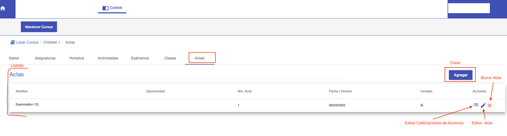
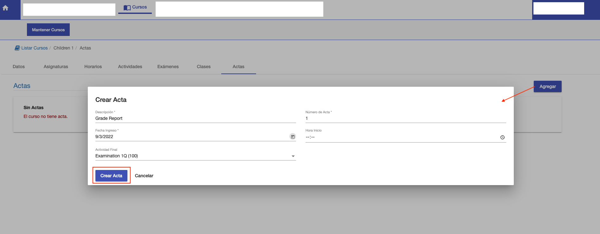
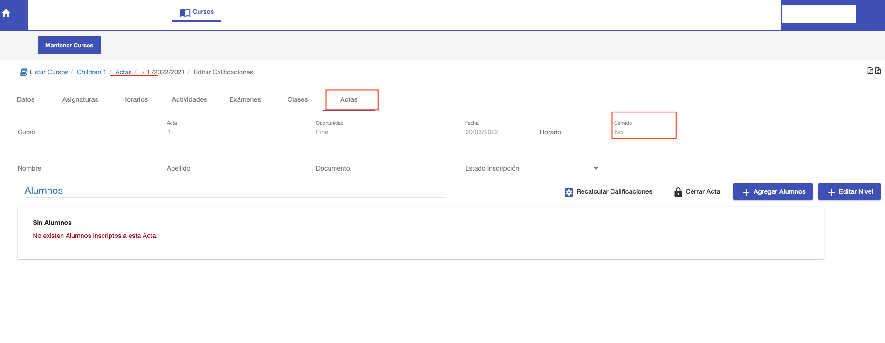
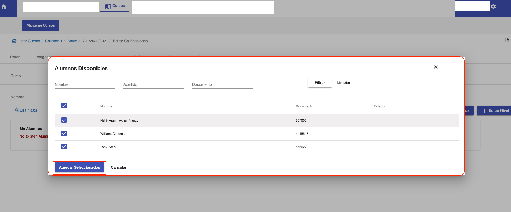
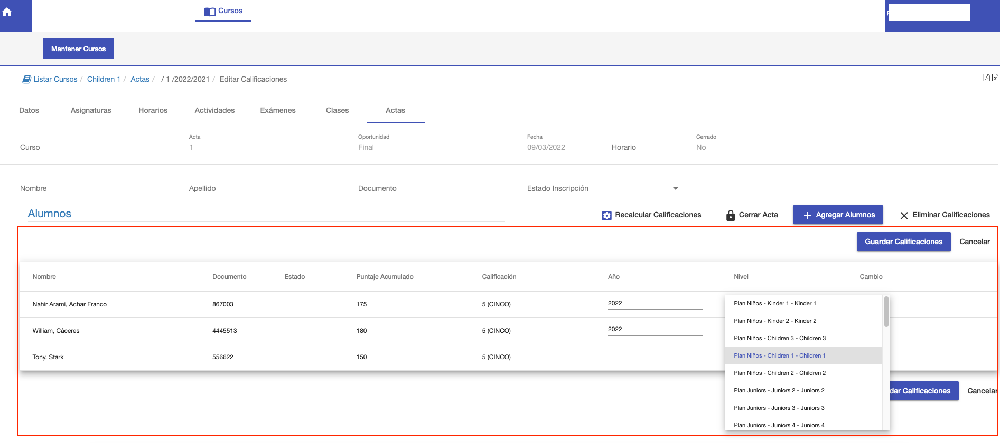
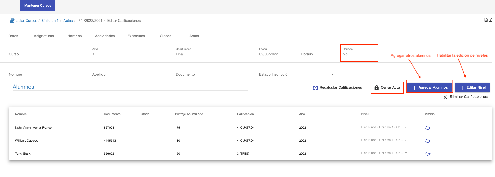
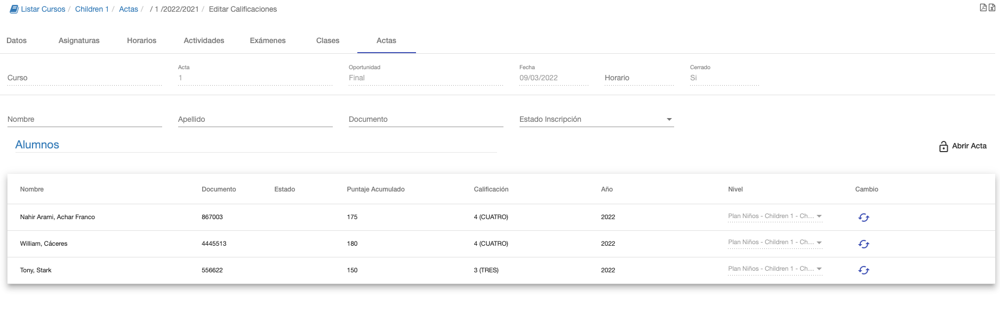

#Actas
El acta se utiliza para registrar de manera oficial las calificaciones de un periodo.
La calificación de un alumno en un acta, ya figura en su ficha.

Para acceder a la funcionalidad Actas, ingresar al curso y luego navegar a la subpestaña *Actas*.

Esta interfaz ofrece:

 - La grilla con el listado de las actas ya creadas para el curso.
 - Botón para crear/agregar Acta

##Listado
El listado muestra las actas ya creadas para el curso.
Para cada acta ofrece las siguientes acciones:

 - Calificaciones: Permite acceder al acta realizar modificaciones de las calificaciones. También permite
abri/cerrar Acta. Eliminar alumno/calificacion de acta.
 - Editar: Permite editar los datos o campos con los que se creó el acta.
 - Eliminar: Permite borrar el acta. Se puede borrar si el acta está Abierto.

##Crear Acta
Para crear un acta clic en el botón Agregar Acta, se despliega una interfaz con los siguientes campos:

 - Descripción: Texto para identificar al acta.
 - Número de acta: Completar un nro para identificar al acta.
 - Fecha de ingreso: Completar la fecha del acta.
 - Hora de inicio: Hora de inicio del acta, si corresponde.
 - Actividad Final: Se debe elegir la actividad del periodo para el que corresponda el acta. Por ej. Elegir la actividad
Examination 1Q, elige la actividad final del primer cuatrimestre y de esa manera asigna el 1Q al acta.

Luego de completar los campos, clic en el botón *Guardar Acta* para crear el acta:

El sistema crea el acta en estado Abierto y despliega la interfaz del acta recién creada. Para poder agregar a los alumnos
necesarios.

Para agregar a los alumnos, clic en el botón *+ Agregar Alumnos* y se despliega un listado con los alumnos disponibles.
Se pueden elegir uno a uno o todos de una vez.

Luego hacer clic en *Agregar Seleccionados*, el sistema muestra una vista previa de las alumnos elegidos con sus
notas calculadas. También permite asignar a cada alumno los datos de nivel que consiste en:

- Año: El año en el que corresponde el nivel del alumno.
- Nivel: El nivel, se elige un nivel del plan de estudio, para ubicar al alumno.

Entonces el acta permite registrar para cada alumno:

- La nota calculada, de acuerdo a su acumulado en la etapa.
- El año y nivel del alumno, asignado por el profesor.

Clic en *Guardar Calificaciones* para confirmar la inclusión de los alumnos, sus notas y niveles en el acta.
Luego de guardar, los alumnos quedan incluídos, pero el acta sigue Abierta.
Para confirmar el acta, se debe Cerrar. Para ello, clic en el botón *Cerrar Acta*.

##Cerrar Acta
Mientras el acta esté abierta, se pueden modificar los niveles, incluir otros alumnos, quitar alumnos, o recalcular las calificaciones.

Luego de cerrar, las notas ya aparecen en la ficha del alumno. Entonces no se pueden realizar modificaciones en el acta.
Aunque hay una operación que se denomina Abrir Acta, para volver a modificar el acta.

