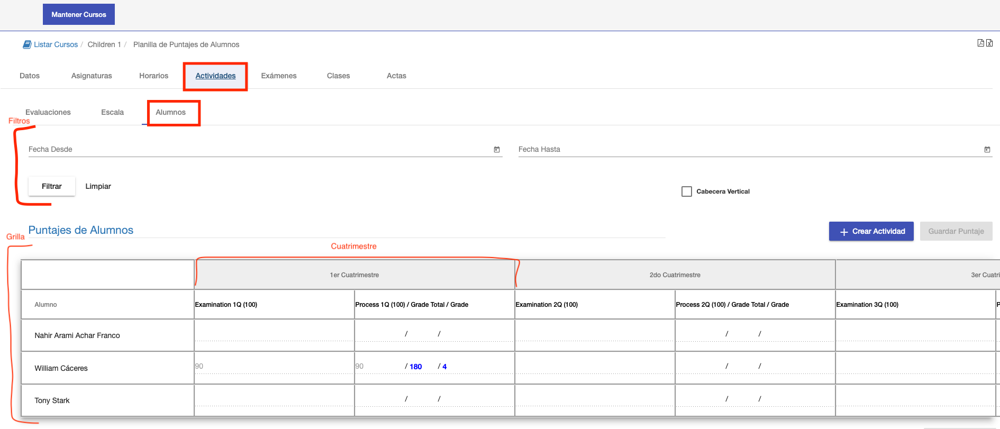
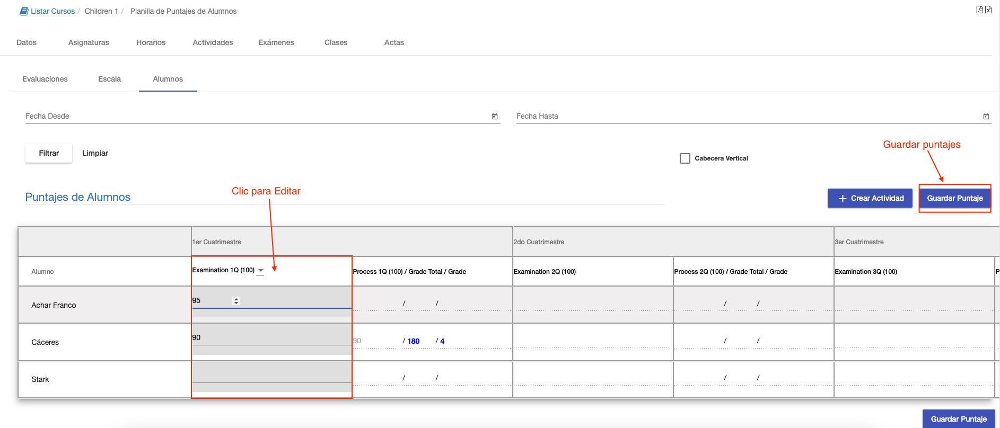
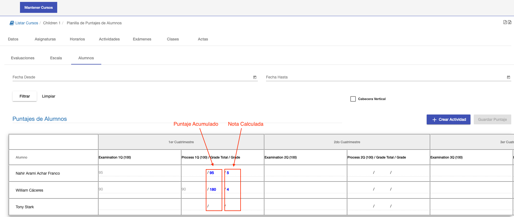

#Puntajes de Alumnos

En la sub pestaña Alumnos se pude registrar y/o consultar los puntajes de los alumnos por evaluación.

La interfaz consiste de:

- Sección de filtros.
- Grilla para registrar y visualizar puntajes de alumnos por evaluación.

## Filtros

La sección de filtros ofrece dos campos Fecha Desde y Fecha Hasta. Estos filtros se utilizan para mostrar en la grilla
los puntajes de evaluaciones con fecha dentro de ese intervalo.
Clic en el botón limpiar, para no aplicar estos filtros y mostrar todas los puntajes.

## Grilla

La grilla muestra los puntajes por alumno y actividad. Cada fila corresponde a un alumno y cada columna a una actividad.
A su vez los puntajes estan agrupados por cuatrimestre.

##Registrar Puntajes
El registro de puntajes se realiza por actividad. 
Se elige una actividad presionando en la columna correspondiente a la actividad. Así se
habilita la edición de esta actividad. Y se puede asignar o modificar el puntaje de cada alumno en la actvidad. Luego de
terminar las asignaciones, clic en Guardar Puntaje. Este botón se habilita al elegir la actividad.

Luego de registrar los puntajes de cada alumno y hacer en el botón *Guardar Puntaje*, el sistema actualiza:
 - El acumulativo de cada alumno por cuatrimestre
 - Calcula la nota correspondiente al cuatrimestre. Esta nota es a modo de información ya que la nota final se registra con
el acta final.

