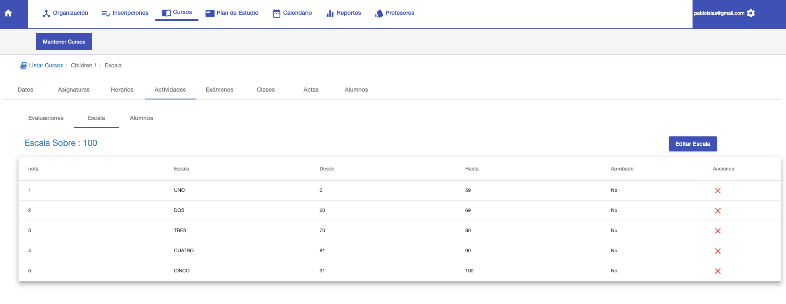
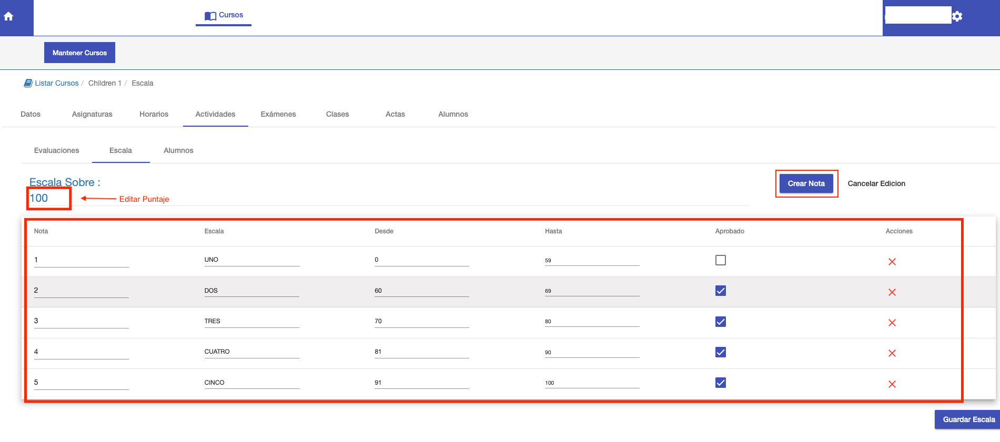

#Escala de Notas
La pestaña Escala permite definir la escala de Notas para el curso. La escala consiste en:

* Puntaje total.
* Las notas que corresponden a cada rango del puntaje total.

La escala se utiliza para:

- Computar las calificaciones parciales que se muestran al ir registrando los puntajes de los alumnos en la pestaña *Alumnos*. Ver Alumnos.
- Computar las calificaciones finales de alumnos, en un acta final. Ver *Actas*.

De manera predeterminada cada curso tiene la siguiente escala asignada:

El puntaje total de la escala puede ser diferente al puntaje total de las actividades de un cuatrimestre. Pero se hace una
ponderación de la suma de los puntajes sobre el puntaje de la escala. Para adaptar al puntaje de la escala.
Para editar la escala, clic sobre el botón *Editar Escala*:

* Se habilita el campo para editar la escala.
* Se habilitan las filas para editar o borrar las notas. En cada fila se puede modificar:
    - Nota. La nota en número
    - Escala. La nota en letras.
    - Desde: Puntaje desde. Inicio del rango.
    - Hasta: Puntaje hasta. Fin del rango.
    - Aprobado: Define si la nota representa o no la aprobación.
    - Para borrar la nota, clic en la columna X.
* Se habilita el botón Crear Nota, que permite agregar una nota a la escala.

