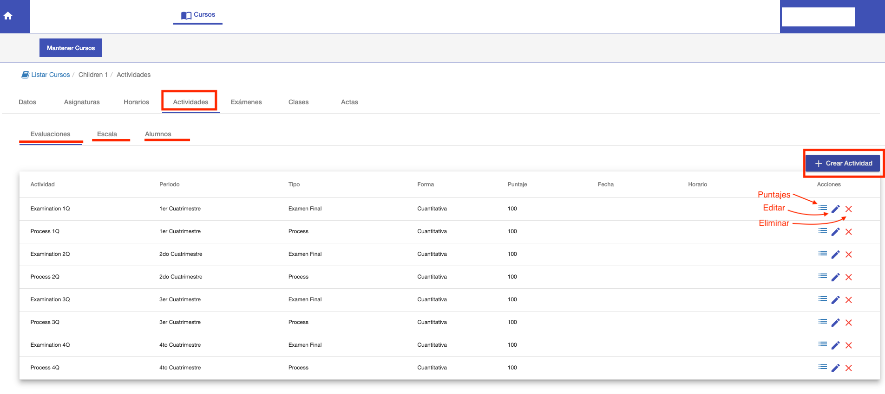

# Actividades

@@toc
@@@ index
* [Escala de Notas](escala_de_notas.md)
* [Puntajes de Alumnos](alumnos.md)
@@@

En la pestaña Actividades se puede:

- Gestionar las evaluaciones del curso.
- Gestionar la escala de notas del curso.
- Asignar puntajes a alumnos en las actividades.

##Evaluaciones
Permite definir las actividades para evaluar a los alumnos del curso.
Las actividades se agrupan por cuatrimestre, donde sus puntajes son sumatorios para dar el total del cuatrimestre.
Luego de definir las actividades, se puede ir asignando los puntajes a los alumnos en cada actividad. El sistema
va computando el puntaje acumulativo total por cuatrimestre.

Cada actividad tiene:

- Nombre: Nombre de la actividad, para distinguir la actividad. 
- Periodo: A qué periodo corresponde la actividad.
- Tipo: El tipo de la actividad pudiendo ser Proceso o Exámen.
- Forma: Evaluacion cuantitativa o cualitativa.
- Fecha: Se puede asignar una fecha, si corresponde.
- Hora Inicio: Se puede asignar hora de inicio, si corresponde.
- Hora Fin: Se puede asignar hora de fin, si corresponde.
- Puntaje: Puntaje total de la evaluación. Se suma a los demás puntajes del periodo para dar
el puntaje total del cuatrimestre.
- Es Sumativa: Indica si la actividad se debe considerar para el acumulativo.

Esta versión del sistema, está configurada para que cada curso tenga de manera predeterminada
1 Process de 100 puntos y 1 Examen Final 100 puntos por cuatrimestre.

Se pueden agregar otras actividades o modificarse las ya existentes si es necesario.

#Crear Actividad

Para agregar una actividad, clic en el botón *+ Crear Actividad*, se despliega la interfaz con los campos necesarios.
Luego de completarlos, clic en *+Crear Actividad* para crear la actividad. La actividad creada, se muestra en la grilla
de actividades.

#Grilla de Actividades
La grilla muestra las actividades definidas para el curso. Cada fila corresponde a una actividad. Para cada fila
la grilla ofrece las siguientes acciones:

*Puntajes. Permite registrar los puntajes de los alumnos en la actividad. Sin embargo, se recomienda utilizar la pestaña Alumnos
para registrar los puntajes.
*Editar Actividad. Permite modificar o editar los datos o campos de la actividad.
*Eliminar Actividad. Permite borrar la actividad. Se puede borrar si no está incluida en algún acta.

 

