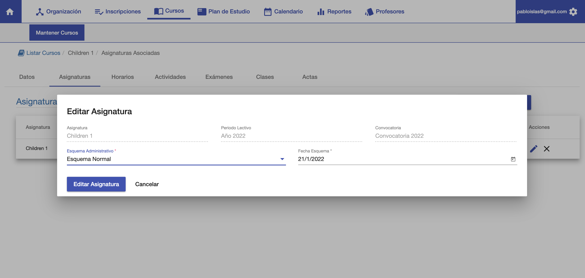

#Asignaturas y Esquemas

La pestaña asignaturas permite:

- Editar la asignatura asociada, esquema y fecha base.
- Asociar otras asignaturas, de otras carreras si es necesario.

##Asignatura y Esquema

El listado muestra la asignatura asociada, su esquema y fecha base. 
El esquema define la matrícula/cuotas que deben generarse para el alumno que se inscribe.
Los esquemas se definen en Voyager/Productos. Los esquemas disponibles para asignar son
los productos de tipo Esquema que están Activos.

La fecha base define desde cuando se generan las cuotas para el alumno.

Como ejemplo, si la fecha base es el 01/02/2022 entonces la matrícula y primera cuota del esquema se generan
el día 01/02/2022. Las siguientes cuotas se calculan apartir de esta fecha.

##Editar Esquema y Fecha Base
Para editar, clic en la acción editar y se despliega una ventana con la siguiente
interfaz:

Permite cambiar el esquema, elegir otro esquema del listado.
Permite cambiar la fecha esquema o fecha base.

Al cambiar un curso que ya esté en proceso, estos cambios se aplican para las nuevas
inscripciones. No afecta a los que ya se inscribieron.

Luego de realizar los cambios, clic en *Editar Asignatura* para guardar los cambios.

