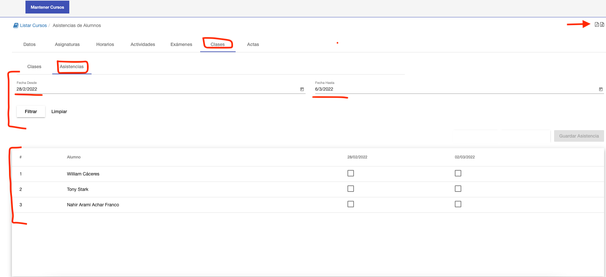
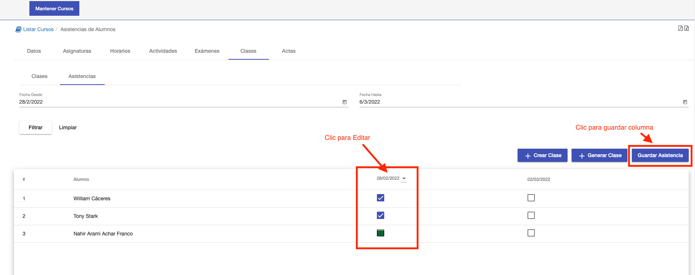
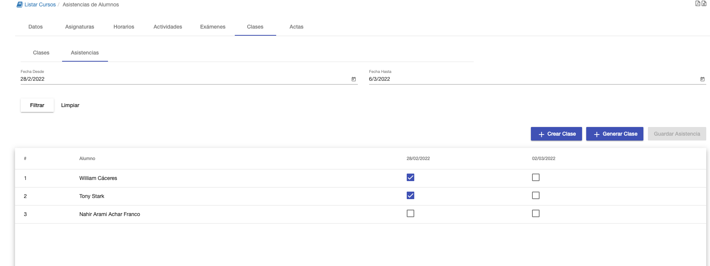
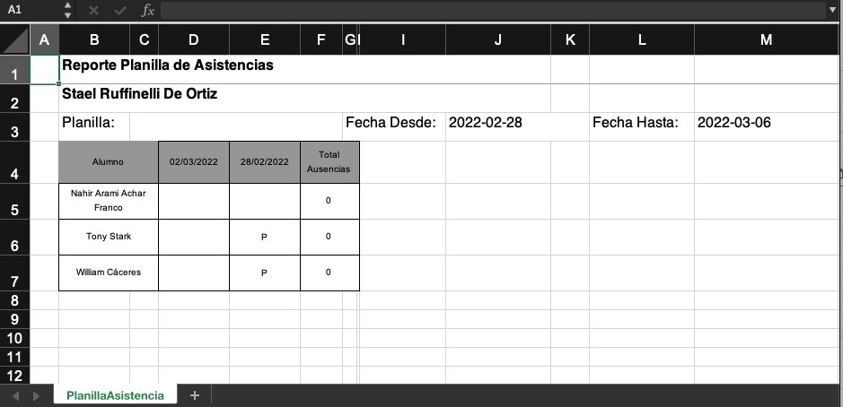

# Asistencias

En la sub pestaña Asistencias se pude registrar y/o consultar las asistencias de los alumnos por clase.

La interfaz consiste de:

- Sección de filtros. 
- Grilla para registrar y visualizar asistencia por alumnos.

## Filtros

La sección de filtros ofrece dos campos Fecha Desde y Fecha Hasta. Estos filtros se utilizan para mostrar en la grilla
las asistencias de clases dentro de ese intervalo. 
De manera predeterminanada estos filtros están configurados para
mostrar las clases de la semana actual. Se pueden cambiar los valores de los filtros y luego clic en buscar para mostrar
los resultados en la grilla. 
Clic en el botón limpiar, para no aplicar estos filtros y mostrar todas las clases del
curso.

## Registrar Asistencia

La grilla muestra las asistencias por alumno y por clase. Cada fila corresponde a un alumno y cada columna a una clase.
Se muestran las asistencias de las clases correspondientes al filtro fecha desde y fecha hasta.

La edición se realiza por clase. Se elige una clase presionando en la columna correspondiente a la clase. Así se
habilita la edición de la clase, y puede asignarse o modificarse la asistencia de cada alumno en dicha clase. Luego de
terminar las asignaciones, clic en Guardar Asistencia. Este botón se habilita al elegir la clase.

Luego de guardar, se muestra la grilla modificada:

.

##Reporte
El sistema permite exportar la asistencia de un curso en formato PDF y EXCEL. El reporte se exporta
de acuerdo a los filtros aplicados. Muestran las asistencias por alumno y por clase. Y un total de ausencias.
Para exportar hacer clic en los botones de la esquina superior derecha.

