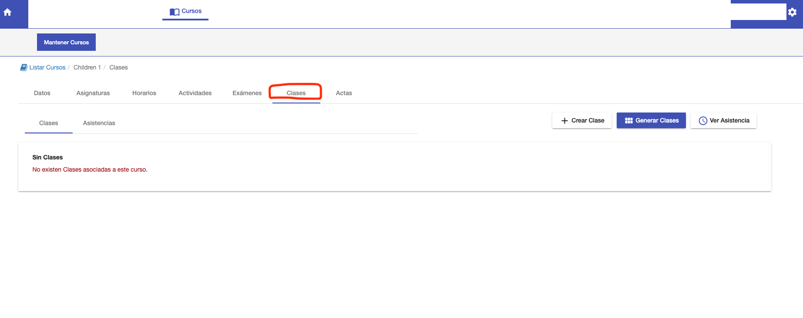
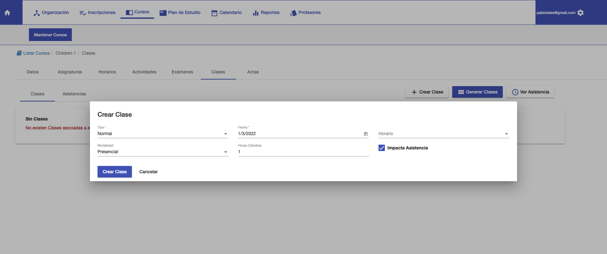

# Clases y Asistencia

@@toc
@@@ index
* [Asistencias](asistencias.md)
@@@

En la pestaña Clases se puede:

- Generar y gestionar las clases del curso.
- Registrar la asistencia de los alumnos en las clases.

Un horario define de manera genérica día y hora de las clases del curso. Una clase consiste en la fecha específica de un
horario. Las asistencias de los alumnos se registran por cada clase. Entonces es necesario crear las clases primero para
poder registrar las asistencias.

La pestaña Clases ofrece:

- Un botón para crear una clase.
- Un botón para generar las clases.
- Una grilla con las clases del curso.

## Crear Clase

Para crear una clase, clic en el botón '+Crear Clase' y se despliega una ventana con los datos para crear una clase:

- Tipo: Define si una clase es normal, recuperatoria etc.
- Fecha: La fecha de la clase.
- Horario: Se asocia al horario al que corresponde según fecha.
- Modalidad: Define si es presencial, virtual etc.
- Horas Cátedra: La cantidad de horas de la clase.
- Impacta Asistencia: Define si la clase se incluye o no para el cálculo del porcentaje de asistencia de los alumnos.

Clic en Crear Clase para confirmar la creación de la clase.

Las clases creadas aparecen en la grilla de clases del curso.

##Generar Clases
El sistema permite generar las clases, para evitar el trabajo de crearlas una a una.
Para generar las clases, clic en el botón Generar Clases. Al pulsar este botón el sistema genera las clases de acuerdo a:

- Fecha desde y Fecha hasta del curso. Se generan clases que correspondan a este intervalo.
- Los horarios definidos para el curso. Se calculan las fechas de acuerdo a los horarios del curso. Y se van generando
para cada fecha y hora que corresponda.
Las clases generadas aparecen en la grilla de clases del curso.

##Grilla de clases
La grilla muestra las clases que se generaron o crearon.
Muestra cada clase en una fila con los siguientes datos:

- Fecha. Fecha de la clase.
- Tipo. Normal o recuperatoria etc.
- Modalidad. Presencial o Virtual.
- Horas. Cantidad de horas cátedra de la clase.
- Suspendida. Indica si la clase fue suspendida.
- Asist. Cargad.?. Indica si la asistencia fue cargada para esta clase.

También cada fila ofrece las siguientes acciones:

- Asistencia. Permite navegar a la pantalla para registrar o modificar asistencia de los alumnos en la clase.
- Suspender Clase. Permite suspender una clase, para indicar que no se va a dar o no se dió.
- Editar Clase. Permite editar la clase y cambiar los datos necesarios.
- Eliminar Clase. Permite eliminar una clase, para que no figure en los registros.

