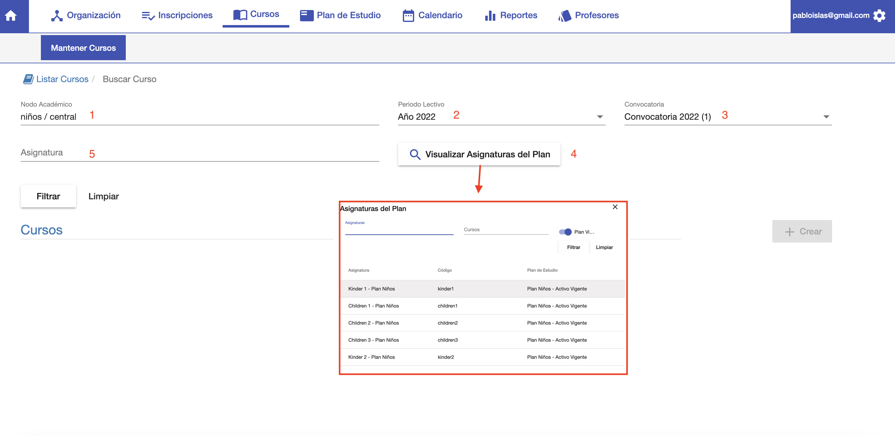
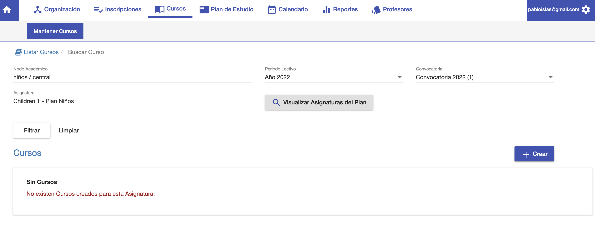
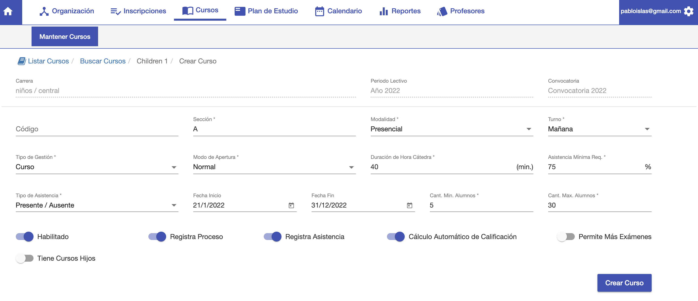

#Crear Curso

Para crear un curso, hacer clic en el botón *Nuevo Curso*, que se encuentra en la interfaz
de listado de cursos.

Se despliega la interfaz para elegir los siguientes datos:

 1- *Nodo Académico*: Elegir un nodo académico para el curso.
 2- *Periodo Lectivo*: Elegir un periodo lectivo para el curso.
 3- *Convocatoria*: Elegir la convocatoria para el curso.
 4- *Visualizar Asignaturas del Plan*: Buscar y Elegir la asignatura.
 5- *Asignatura Elegida*

Cuando se elije la asignatura, se muestran los cursos ya creados que coinciden con los
datos ya elegidos.

Se habilita el botón +Crear. Clic en el botón para continuar con la creación. 

En este paso se pueden elegir los siguientes datos:

 - *Código*: Se puede dejar vacio y el sistema va a generar un código.
 - *Sección*: Se puede asignar una sección para diferenciar de otros cursos.
 - *Modalidad*: Se puede elegir la modalidad. Presencial, Virtual etc.
 - *Turno*: Mañana, Tarde, Noche
 - *Gestión*: Curso o Exámen. Curso para dictar un curso o Examen para dictar sólo exámen.
 - *Modo de Apertura*: Normal, Tutorial etc.
 - *Duración de Hora Cátedra*: Cuantos minutos dura la hora cátedra de este curso.
 - *Asistencia Mínima Requerida*: La asistencia mínima requerida para los alumnos.
 - *Tipo de Asistencia*: Presente/Ausente o Por Hora Cátedra.
 - *Fecha de Inicio*: Fecha de inicio del curso.
 - *Fecha de Fin*: Fecha de fin del curso.
 - *Cantidad Mínima de Alumnos: Cantidad Mínima para abrir el curso.
 - *Cantidad Máxima de Alumnos*: Cantidad Máxima de alumnos del curso.
 - *Habilitado*: Marca si el curso está habilitado o no para inscripciones.

Clic en *+Crear* Curso para crear el curso con los datos elegidos.
Luego de crear el curso, el sistema despliega el curso creado para continuar editando
sus datos.

