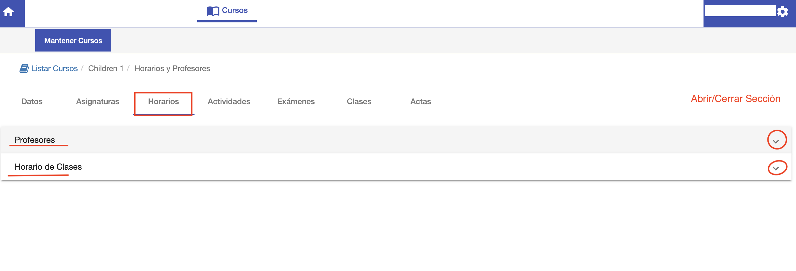
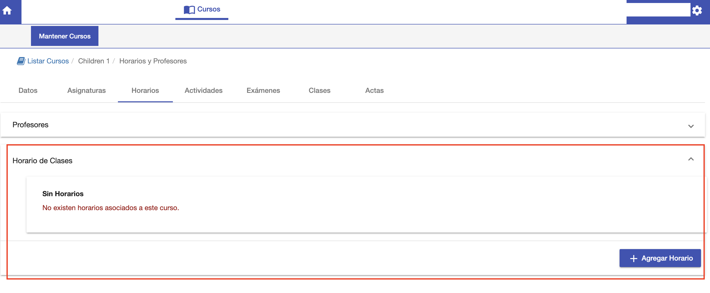
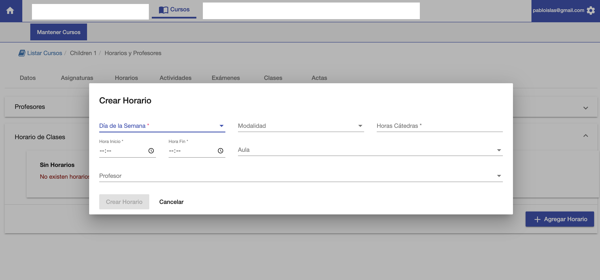
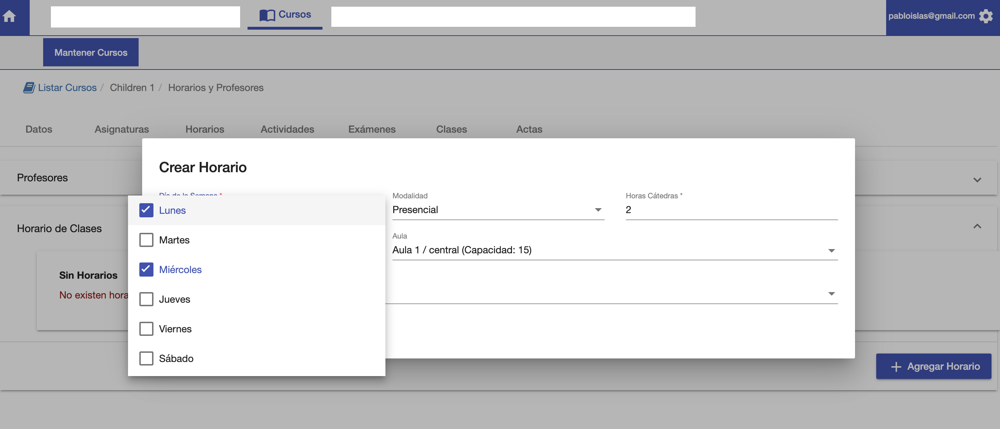
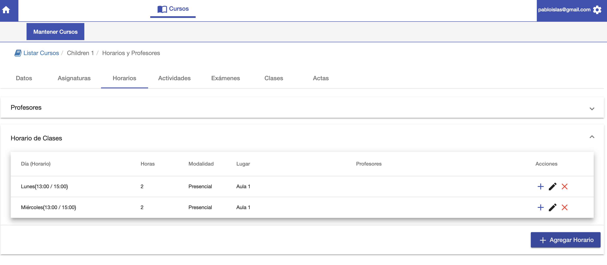
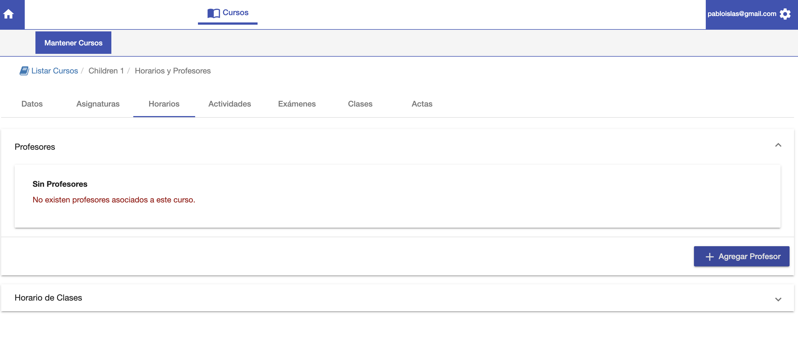
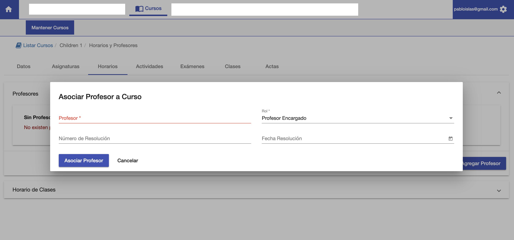
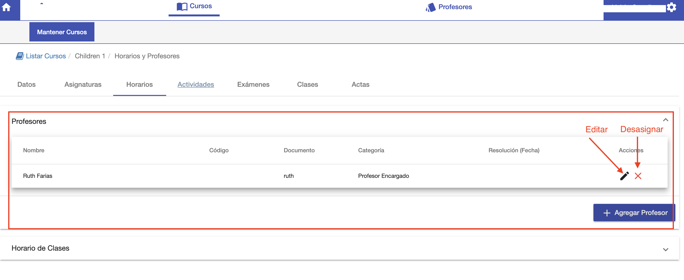

#Horarios y Profesores

En la pestaña horarios se puede:

- Asignar los horarios de clase al curso.
- Asignar los profesores al curso.

##Horarios de clase
Un horario de clase permite definir de manera genérica, sin fecha específica, los horarios semanales
de clases de un curso.
Luego, apartir de los horarios, se deben generar las clases que ya son con Fecha y Hora específicos.
Para asignar horarios de clase, ir a la sección *Horario de Clases*.

En esta sección 
 - Se muestran los horarios ya creados.
 - Se puede agregar horario de clases.

Para agregar un horario de clase clic en el botón *+Agregar Horario* y se despliega
una ventana con los siguientes datos:

* Día de la Semana*: Se pueden elegir los días de la semana.
* Modalidad*: Presencial, Virtual etc
* Horas Cátedra: La cantidad de horas cátedra del horario.
* Hora Inicio: A qué hora empieza el horario.
* Hora Fin: A qué hora termina el horario.
* Aula: Dónde se van a dictar las clases de este horario.
* Profesor: Qué profesor va a dar el horario. Si es el mismo profesor, se puede definir en la
sección Profesores.

Luego de agregar el horario, se muestra el horario en el listado:

En este ejemplo, se agrega de una vez, dos horarios de clase en la misma hora pero en días distintos.

##Profesores

En la sección Profesores:
- Se listan los profesores asignados al curso.
- Se pueden asignar los profesores al curso.

Para agregar un profesor, clic en el botón *+ Agregar Profesor* y se despliega
una interfaz donde se puede elegir un profesor disponible. Los profesores disponibles se gestionan en el módulo *Profesores*.

Los campos requeridos son:

- *Profesor*: Elegir un profesor disponible del listado
- *Rol*: Profesor encargado, ayudante etc.

Luego de completar clic en *Asociar Profesor* y el sistema asocia el profesor al curso y muestra
al profesor en la grilla.

En esta grilla de profesores, se puede:

- Desasignar profesores.
- Editar profesores asignados. Modificar el profesor o su rol.

