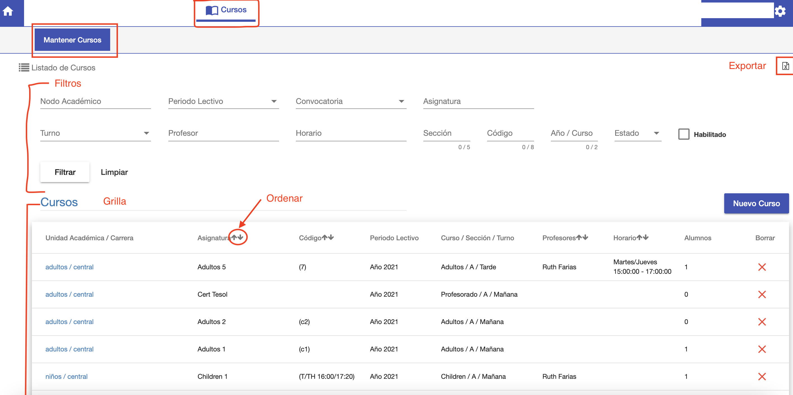

#Cursos

@@toc
@@@ index
* [Crear Curso](crear_curso.md)
* [Editar Curso](editar_curso.md)
* [Asignatura, Esquema y Fecha Base](asignaturas.md)
* [Horarios](horarios.md)
@@@

Los cursos se utilizan para dictar las asignaturas a los alumnos en un periodo.
Para definir un curso se debe:

- Asociar a un periodo lectivo. Donde se va a dictar el curso.
- Asociar a una asignatura correspondiente a un plan de una carrera de una sede.
- Asignar su esquema de precio o arancel.
- Asignar su turno y horarios de clases.
- Asignar sus profesores.

Para ingresar a la funcionalidad de cursos, ir al módulo *Cursos* y luego ingresar en la opción
*Mantener Cursos*.

Se despliega el listado de cursos.

##Listado de Cursos
El listado ofrece una grilla con los cursos ordenados de manera descendente por fecha de creación. Los últimos
creados se muestran primero en la lista.

La grilla tiene una sección de filtrado, que permite buscar los *cursos* de acuerdo a los siguientes filtros:

 - *Nodo Académico*: Permite buscar por Carrera/Sede.
 - *Periodo Lectivo*: Luego de elegir Carrera/Sede, se puede filtrar por Periodo Lectivo.
 - *Convocatoria*: Luego de elegir Periodo Lectivo, se puede elegir convocatoria.
 - *Asignatura*: Permite buscar por asignatura. Escribir nombre de asignatura para buscar.
 - *Turno*: Permite buscar por turno.
 - *Profesor*: Permite buscar cursos por profesor. Escribir nombre del profesor.
 - *Horario*: Permite buscar cursos por horario. Escribir horario, dia u hora.
 - *Sección*: Permite buscar cursos por sección.
 - *Código*: Permite buscar curso por código.
 - *Año / Curso*: Permite buscar curso por año de calendario y año/curso.
 - *Estado*: Permite buscar cursos por estado.
 - *Habilitado*: Permite buscar cursos habilitados o no.

Luego de completar los campos deseados clic en el botón *Filtrar* para realizar la búsqueda.
Los resultados se muestran en la grilla de Cursos.

El botón limpiar se utiliza para restablecer los campos de búsqueda y la grilla de resultados.

La grilla muestra el listado de los cursos con los siguientes campos:

 - *Carrera/Nodo Académico*.
 - *Asignatura*.
 - *Código*.
 - *Periodo Lectivo*.
 - *Curso/Sección/Turno*.
 - *Profesores*.
 - *Horario*
 - *Alumnos*: Cantidad de alumnos.

La grilla permite ordenar los resultados por Asignatura, Código, Profesores y Horario.

##Exportar Listado
El listado de cursos se puede exportar en formato Excel haciendo clic en el ícono ubicado
en la esquina superior derecha. Se exportan los resultados de acuerdo a la búsqueda
realizada con los filtros.

