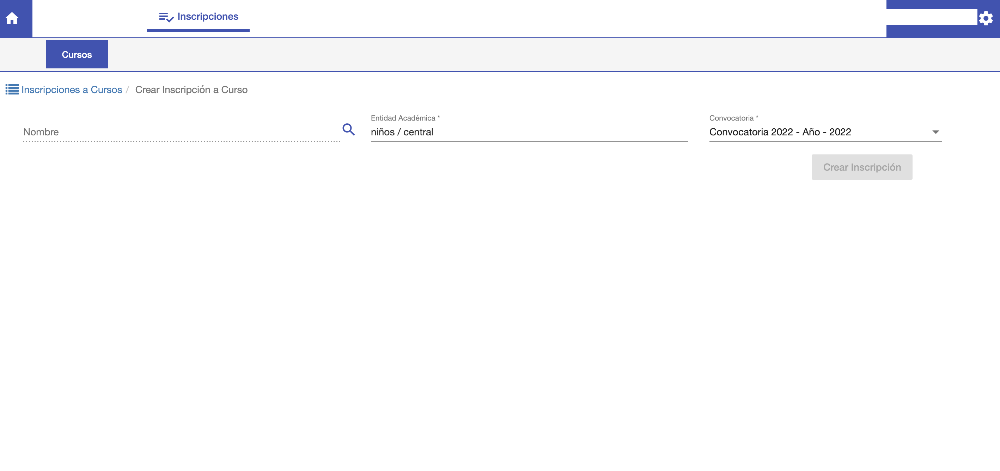
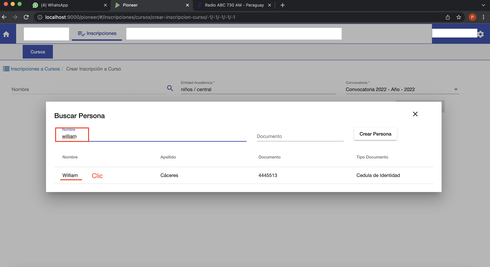
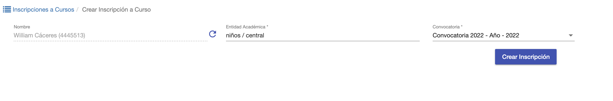
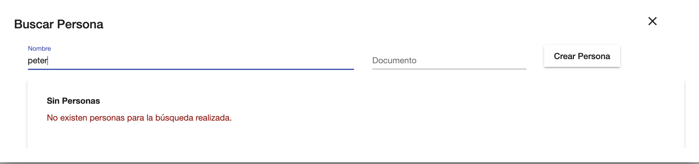

#Crear Inscripcion

Para crear una nueva inscripción clic en el botón *Nueva Inscripción*, que se encuentra en el listado
de inscripciones.

Se habilita una interfaz donde se debe completar:

- *Nombre*: Buscar Persona/Alumno para inscribir.
- *Entidad académica*: Carrera/Sede donde se va a inscribir
- *Convocatoria*: Buscar la convocatoria donde se puede inscribir para la Carrera/Sede.

Al hacer clic en el campo *Nombre* se despliega un ventana donde se puede buscar a la persona
por nombre o documento. Si la persona ya se encuentra registrada, se va a mostrar en la grilla
de resultados y se puede elegir.

Luego de elegir, se asocia el alumno elegido al campo *Nombre* en la pantalla para crear inscripción.

Si no se encuentra registrado entonces se puede crear un alummo nuevo e inscribirle.

Para eso clic en *Crear Persona* y se despliega una ventana para crear la persona:

Esta interfaz tiene los siguientes campos:

- *Nombre*: Nombre/s de la persona.
- *Apellido*: Apellido/s de la persona.
- *Número de Documento*.
- *Tipo de Documento*. Cédula, Pasaporte, Ruc etc
- *Estado Civil*: Estado civil de la persona. Opcional
- *Nacionalidad*: Nacionalidad de la persona.
- *Fecha de Nacimiento*: Opcional.
- *Masculino o Femenino*: Opcional

Luego de completar los datos clic en Crear Persona. El sistema crea la persona y asigna
la persona creada al campo *Nombre* en la pantalla para continuar creando la inscripción.

Luego de completar los datos para crear la inscripción clic en el botón *Crear Inscripción* y el 
sistema crea la inscripción del alumno en la carrera y despliega la inscripción creada
para continuar con la inscripción a los cursos.

