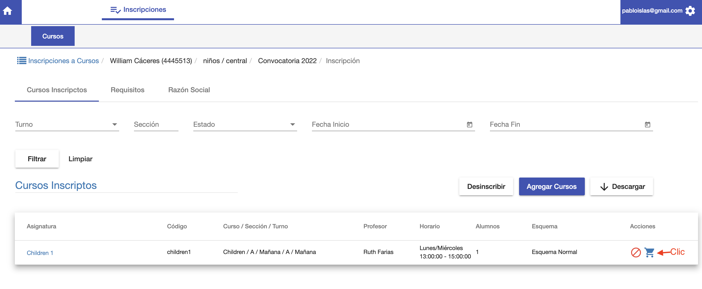
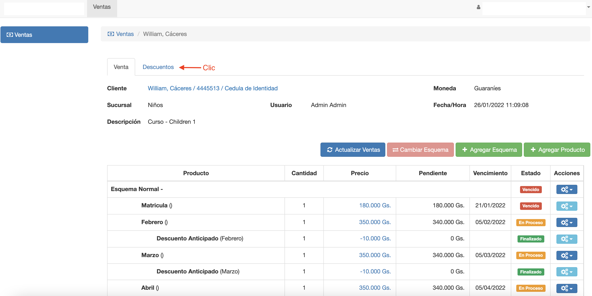
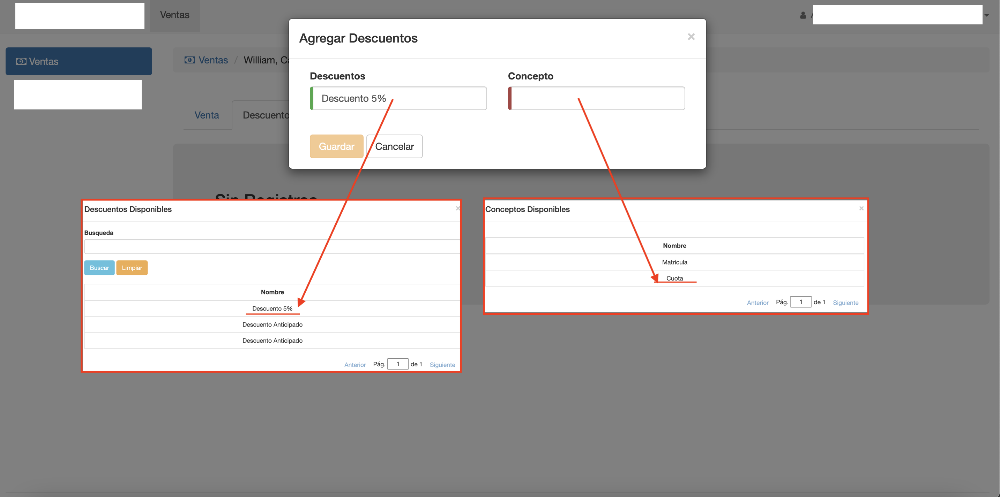
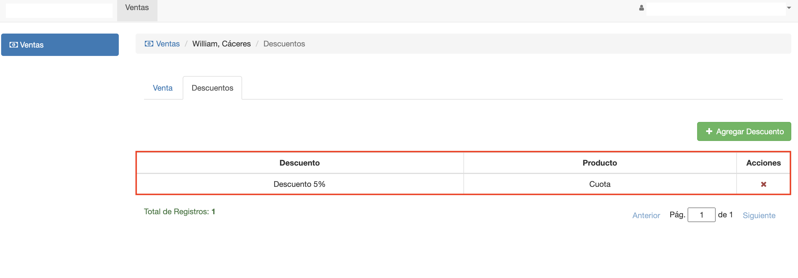
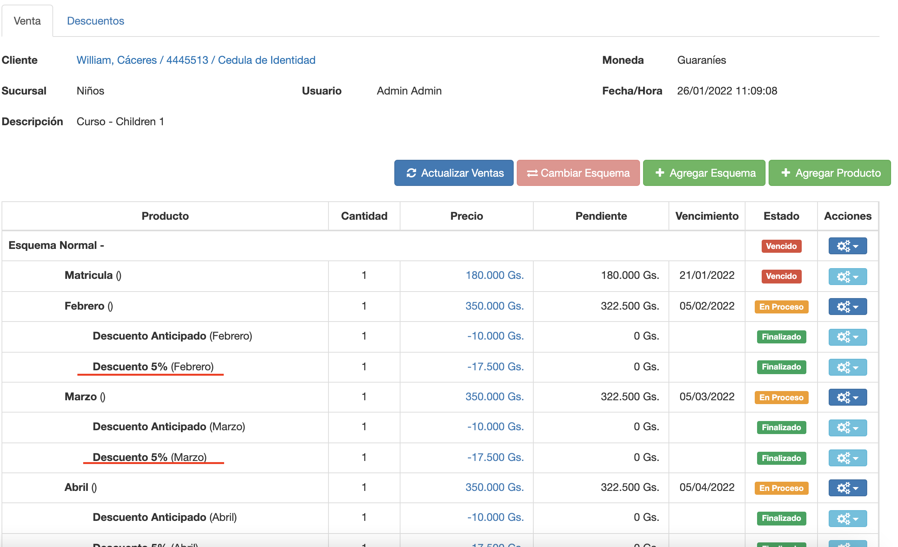
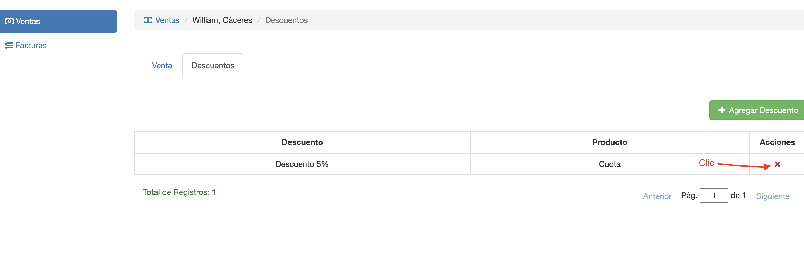

#Descuentos de alumno

Luego de generar la deuda por la inscripción de un alumno, se le puede asignar descuento.
El descuento aplicado a la deudas, se incluye automáticamente al facturar las deudas.
Para asignar descuento, ir a la deuda del alumno:

Se despliega la deuda del alumno en Voyager/Ventas. En esta interfaz abrir la pestaña
Descuentos.

Se despliega el listado de descuentos aplicados a la deuda del alumno.

###Agregar Descuento
Para agregar un descuento clic en el botón *+ Agregar Descuento* y se despliega una
ventana para agregar descuento con los siguientes campos:

- *Descuentos*: Elegir el descuento a aplicar. 
Los descuentos se deben definir previamente en @ref:[Voyager/Ventas/Descuentos](../../productos/descuentos/index.md).
- *Concepto*: Elegir el concepto de la deuda, al que se va a aplicar el descuento. El concepto se refiere al concepto genérico como Cuota o Matrícula.
Al aplicar a la cuota, el descuento se aplica a todos los items de la deuda de tipo Cuota.

Luego de elegir los campos clic en *Guardar*, se aplica el descuento y se lista en la grilla
de descuentos aplicados:

En la pestaña Venta se puede ver la aplicación del descuento en los items que 
corresponden al concepto:

###Borrar Descuento

Para borrar el descuento clic en el botón X del descuento:

El descuento se borra del listado y se desaplica de los items a los que se aplicó.

