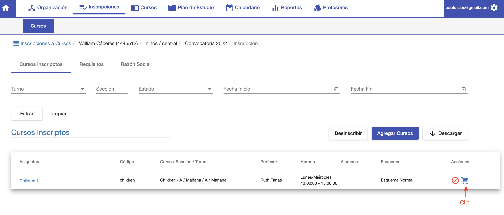
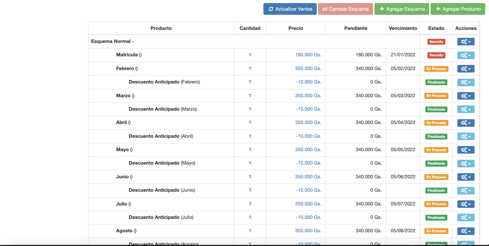
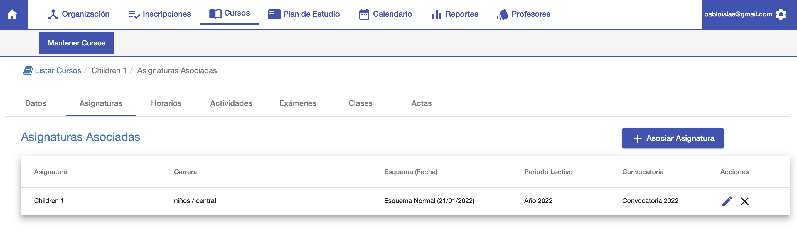
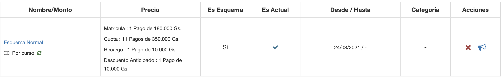

#Deuda de Inscripcion
Al inscribir a un alumno a curso. Se genera una deuda para el alumno de acuerdo a
el esquema del curso y la fecha base definida en el curso.

Para acceder a la deuda, clic en el ícono de carrito de compra en la inscripción. Es un enlace
que lleva a la venta generada:

###Esquema del curso
En este ejemplo el curso tiene asignado el Esquema Normal y la fecha base es 21/02/2022.

Entonces esto significa que cuando hay una inscripción al curso, se aplica el esquema
normal apartir de la fecha 21/02/2022.

El esquema normal asignado al curso está conformado de la siguiente manera:

Según la configuración de los vencimientos:

 - La matrícula se paga en la fecha base del curso.
 - Las cuotas apartir del mes siguiente el 5 de cada mes.
 - Se habilita automáticamente un descuento por pago anticipado para las cuotas.
 - Se habilita un recargo por pago atrasado luego de 1 mes.

Para ver más detalles sobre los esquemas:

- @ref:[Precio de tipo Esquema](../../productos/tipos_de_productos/precio_de_venta.md#precio-esquema)
- @ref:[Conceptos de Esquema](../../productos/tipos_de_productos/conceptos_para_esquema.md#concepto-para-esquema)
- @ref:[Esquemas](../../productos/productos/editar_productos_precios.md#precio-esquema) 

