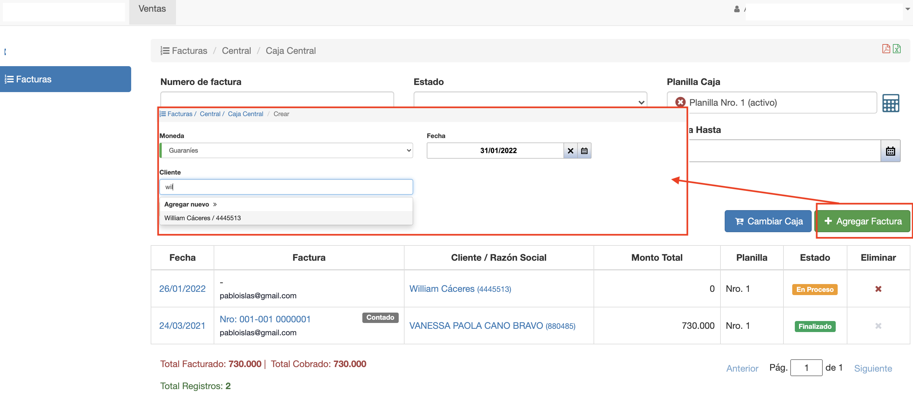
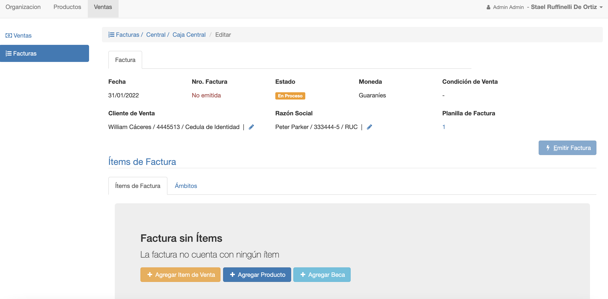
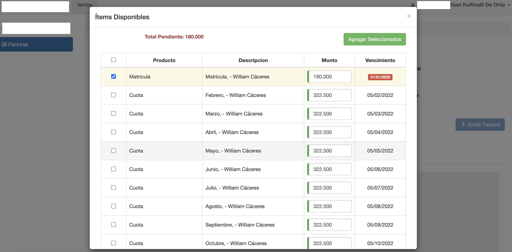

#Facturación de Deudas de Inscripción

Las deudas generadas por la inscripción de un alumno se pueden
cobrar registrando una factura de venta para el alumno.

Para facturar las deudas de inscripción de un alumno, ir a Voyager
al módulo Ventas/Facturas.

Se despliega la interfaz de listado de facturas. Hacer clic en el botón
*+ Agregar Factura* y elegir cómo cliente el alumno para el que se van
a cobrar las deudas.

Se crea la factura para el alumno y con la razón social asignada al alumno.

.

Luego para incluir las deudas del alumno clic en *Agregar Item de Venta* y se despliegan
las deudas pendientes:

Se pueden agregar los items necesarios y emitir la factura.
Para más detalles sobre cómo crear y emitir facturas ver: @ref:[Facturas](../../ventas/facturas/index.md) 