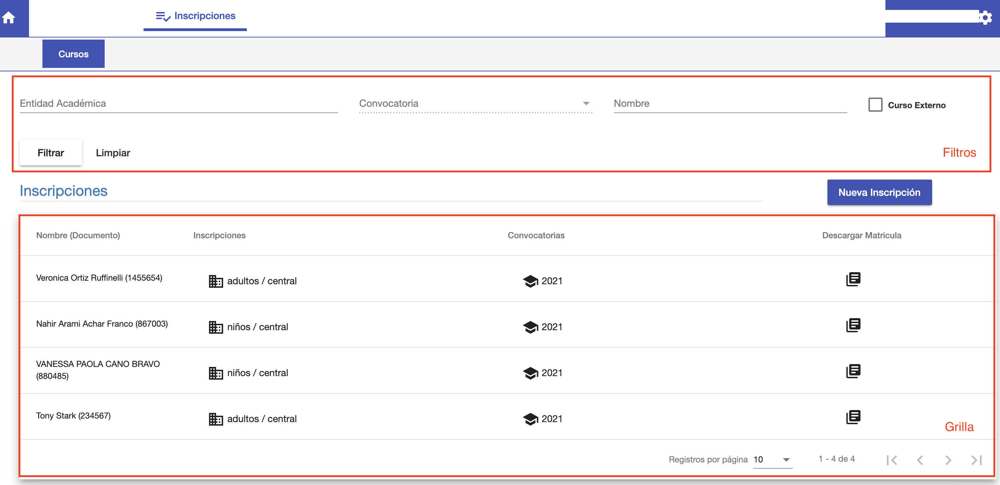

#Inscripciones
@@toc
@@@ index
* [Inscripciones a Carrera](crear_inscripcion_carrera.md)
* [Inscripciones a Cursos](inscripciones_a_cursos.md)
* [Deuda de Inscripcion](deuda_de_inscripcion.md)
* [Pago de Deudas](pago_de_deudas.md)
@@@

El módulo inscripciones se utiliza para:

- Inscribir a alumnos en Carrera/Periodo Lectivo.
- Inscribir a alumnos en Curso/s correspondientes a su carrera/periodo lectivo.

Para acceder a estas funcionalidades ir al módulo *Inscripciones* y luego ingresar
en la opción *Cursos*.

Se despliega una interfaz con el listado de inscripciones de los alumnos por Carrera/Periodo Lectivo.

##Listado

El listado de inscripciones tiene dos secciones:

- Una sección de filtros de búsqueda.
- Una grilla con el listado de inscripciones.

###Filtros de búsqueda

Los filtros para buscar inscripciones son:

 - *Entidad Académica*: Permite elegir una Carrera/Sede y buscar inscripciones de esa Carrera/Sede.
 - *Convocatoria*: Permite elegir una convocatoria de la Carrera/Sede elegida y buscar inscripciones de esa convocatoria.
 - *Nombre*: Permite buscar por nombre o documento de un alumno.
 
Luego de completar los filtros de búsqueda deseados hacer clic en filtrar para mostrar
los resultados en la grilla.
El botón Limpiar es para restablecer los criterios y los resultados en la grilla.

###Grilla
En la grilla se muestran las inscripciones por alumno/carrera/convocatoria. Se muestran de acuerdo a los filtros
de busqueda. Si no hay filtros aplicados, se muestran todas las inscripciones en orden cronológico.

Los campos que se muestran de cada inscripciones son:

- *Nombre*: Nombre del alumno inscripto.
- *Documento*: Documento principal del alumno inscripto.
- *Carrera/Sede*: La Carrera/Sede en la que está inscripto el alumno.
- *Convocatoria*: La convocatoria de la inscripcion. La convocatoria corresponde a un periodo lectivo y año académico.

