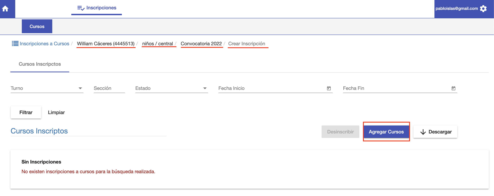
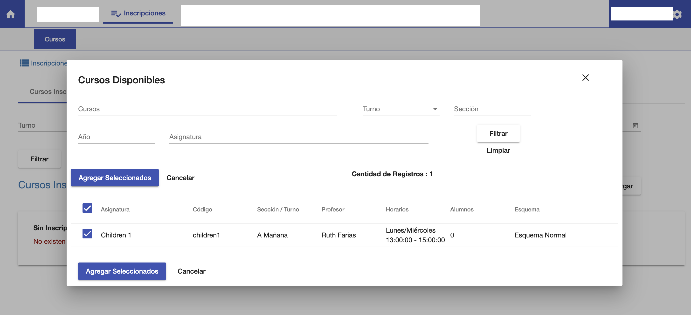
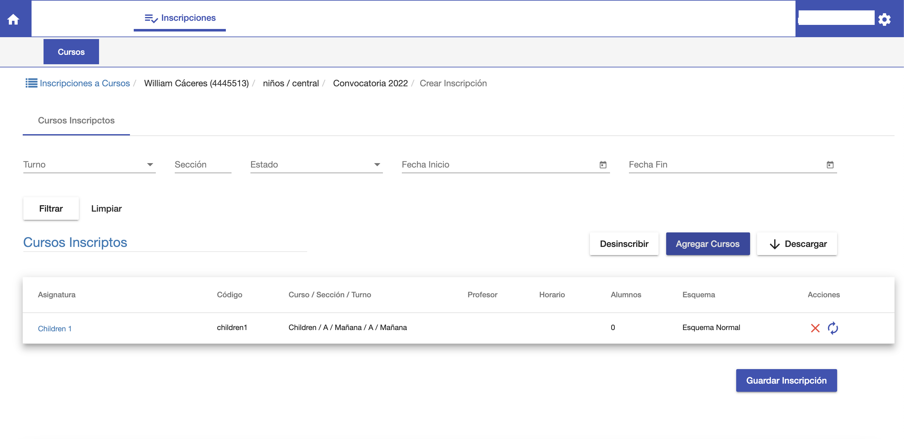
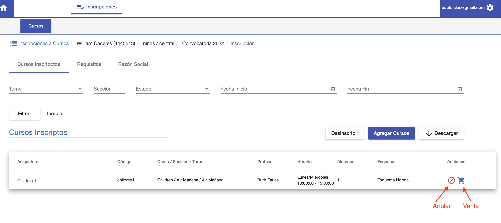

#Inscripciones a curso

Luego de crear una inscripción de un alumno a una Carrera/Sede se puede inscribir
al alumno a los cursos.

Entonces al crear/abrir la inscripción a Carrera del alumno, se despliega una interfaz/pestaña de 
*Cursos Inscriptos* donde se puede inscribir al alumno a los cursos disponibles para la
carrera y periodo.

En esta pestaña hacer clic en el botón *Agregar Cursos* para elegir el curso o los cursos para inscribir al
alumno. Se despliega una venta con los cursos disponibles:

En esta ventana se selecciona el curso al que se va a inscribir y luego clic en 
*Agregar Seleccionados*.

Se muestra una pantalla con los cursos seleccionados pero aún no confirmados, clic en *Guardar Inscripción*
para confirmar la inscripción.

Luego de guardar la inscripción, el sistema hace el proceso de inscripción y al terminar muestra
la inscripción ya confirmada en el grilla de inscripciones a curso.

La inscripción se muestra con los siguientes Datos:
*Asignatura*: Nombre de la asignatura en la que se inscribió. Este campo es un link para ir al curso donde se inscribió el alumno.
*Codigo*: Codigo del curso.
*Curso/Seccion/Turno*: Curso, Sección y Turno del curso.
*Profesor*: Profesores del curso.
*Horario*: Horarios del curso.
*Alumnos*: Cantidad de alumnos inscriptos en curso.
*Anular*: Permite anular la inscripción y quitar al alumno del curso.
*Venta*: Permite navegar a la venta o dueda del alumno que se generó al inscribir al curso con el
esquema del curso.

###Anulación
Para anular una inscripción clic en el botón Anular. Se anula la inscripción y la deuda
generada.

