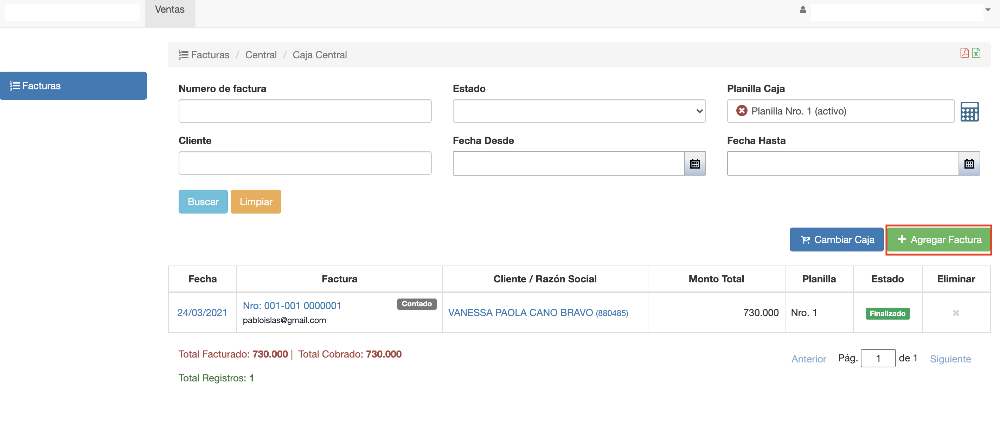
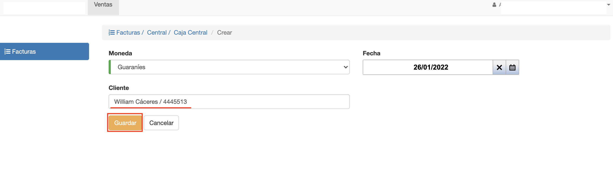
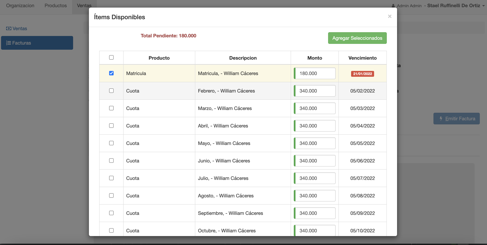

#Pago de Deudas
Para el pago de deudas de un alumno ir al módulo *Ventas/Facturas* de Voyager
se despliega el listado de facturas.

Clic en Agregar Factura y se despliega la interfaz para elegir el alumno para el que
se quiere pagar deudas.

Elegir el alumno y clic en Guardar. Se crea la factura donde podemos
elegir que deuda facturar y luego emitir la factura.

Ver más detalles de cómo facturar en @ref:[Editar Factura](../../ventas/facturas/editar_factura.md)

