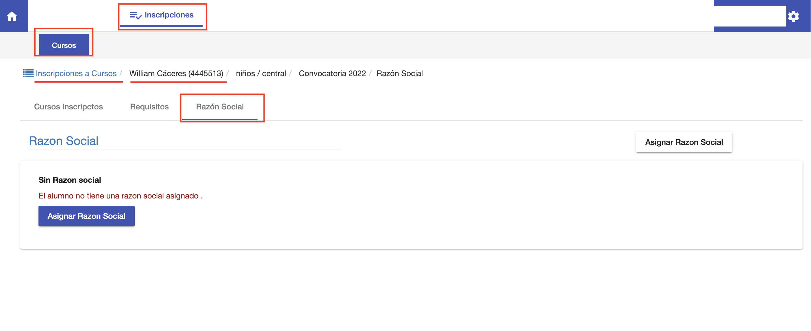
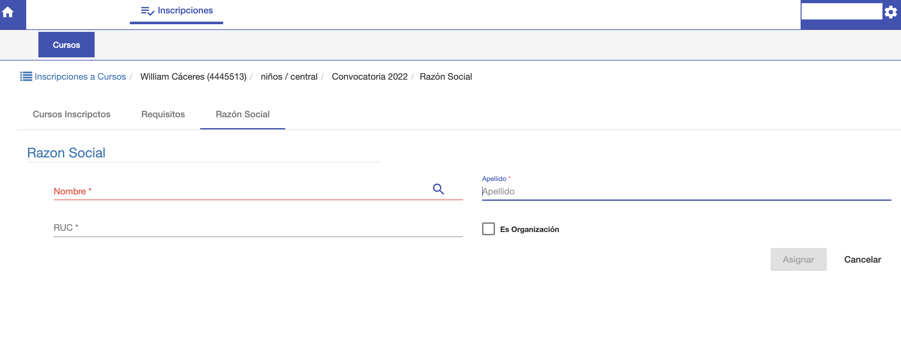
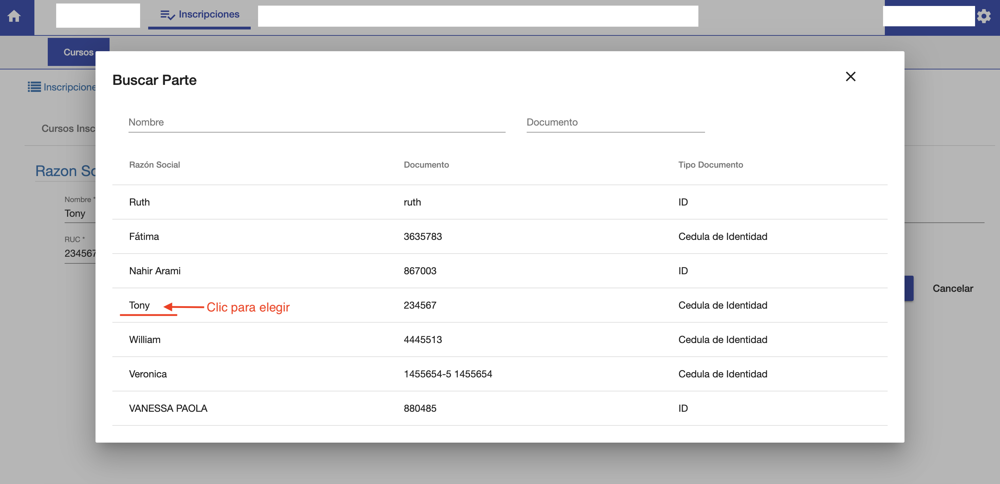
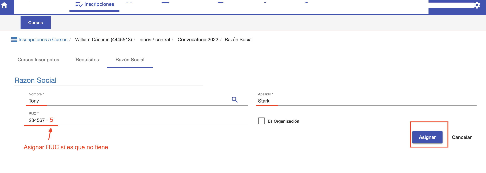
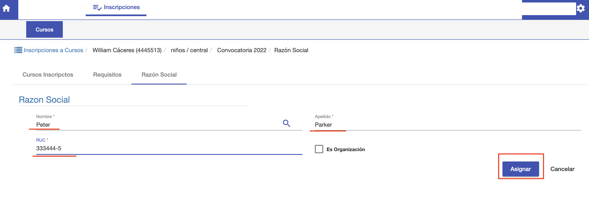
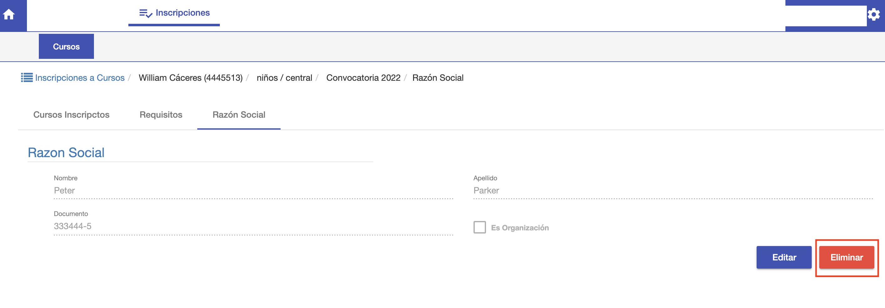

#Razon Social

La pestaña *Razón Social* se utiliza en caso de que el alumno
no facture a su nombre. Permite asignar otra razón social, Nombre y RUC, para 
la emisión de sus facturas.

Para asignar la razón social a un alumno, ingresar a la inscripción del alumno e ir 
a la pestaña *Razón Social*.

##Asignar Razón Social

Para asignar la razón social clic en el botón *Asignar Razón Social*. Se despliega
la siguiente interfaz:

En esta interfaz se puede:

 - Buscar la razón social y asignar.
 - O crear la razón social y asignar.

##Buscar y asignar

Para buscar si la razón ya existe en sistema, clic en la 🔎 y se habilita
una ventana para buscar por Nombre o Documento.

Si ya existe la persona o empresa, puede elegirse y el sistema
despliega la interfaz anterior ya con los datos elegidos. En esta interfaz
se puede completar el RUC, si hace falta, y luego hacer clic en *Asignar* para
asignar la razón social al alumno.

##Crear y Asignar
Si es que no se encuentra la razón social, se puede completar los datos para
crearla y luego asignar la nueva razón al alumno.

##Eliminar razón social
Para quitar la razón social del alumno, clic en el botón
Eliminar.
Esto desasigna la razón social del alumno. Y permite asignar otra razón si es necesario.

##Editar Razón Social
La razón social asignada se puede editar para modificar sus datos o corregir el RUC.
Es importante resaltar que la edición se realiza sobre la razón social ya asignada.
Para cambiar la razón social a otra, es necesario *Eliminar* la razón social primero y asignar otra.

