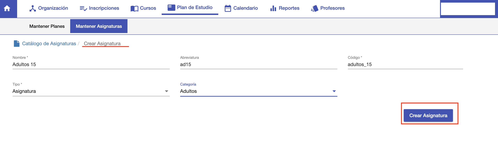
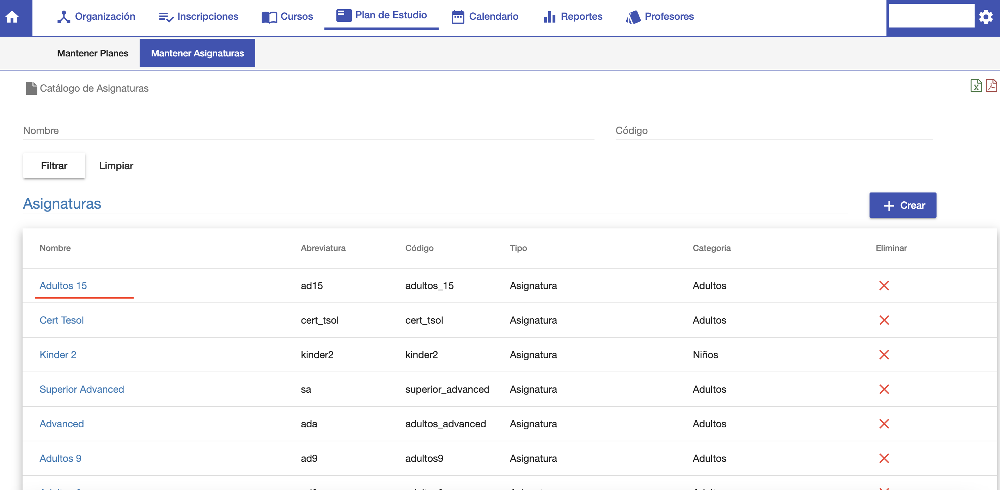

#Crear Asignatura

Para crear una asignatura, clic en el botón +Crear de la pantalla de listado.
Se despliega una interfaz donde se deben completar los siguientes campos:

- *Nombre*: Nombre de la asignatura.
- *Abreviatura*: Nombre abreviado de la asignatura.
- *Codigo*: Código único para identificar a la asignatura.
- *Tipo*: El tipo de asignatura que en caso de Stael sólo se utiliza Asignatura.
- *Categoria*: Para categorizar una asignatura. Se puede utilizar luego para buscar una asignatura
al momento de asignar a un plan.

Luego de completar los datos clic en *Crear Asignatura*. El sistema crea la asignatura y luego
despliega la interfaz de listado mostrando la asignatura creada.

