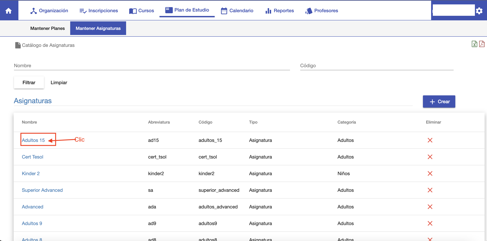
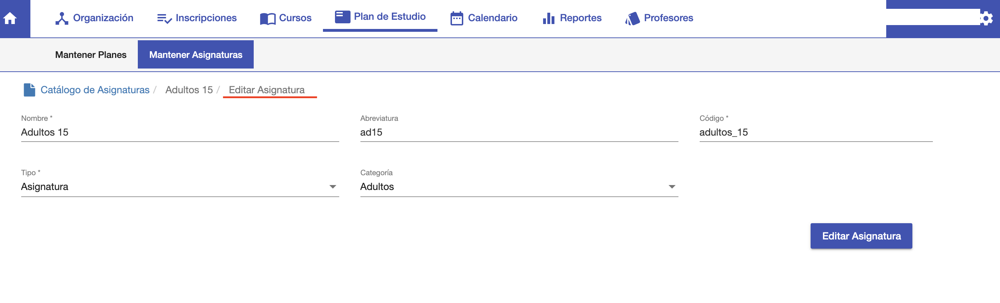

#Editar Asignatura
Para editar una asignatura ir al listado, buscar la asignatura y hace clic en el nombre de la asignatura.
Se despliega la interfaz para editar la asignatura elegida.

En esta interfaz se puede modificar los datos con los que se creó la asignatura.

Luego de modificar clic en Editar Asignatura para registrar los cambios.

