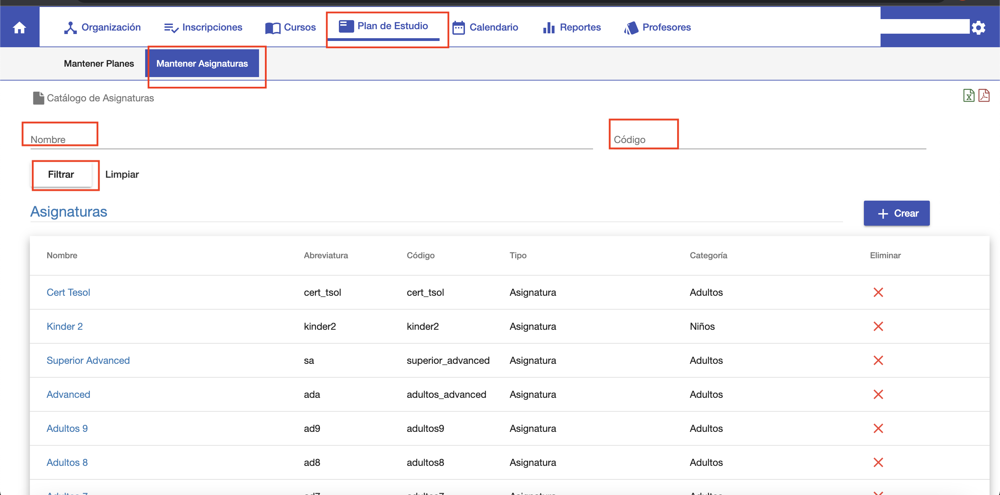

#Asignaturas

@@toc
@@@ index
* [Crear Asignaturas](crear.md)
* [Editar Asignatura](editar.md)
* [Borrar Asignatura](borrar.md)
* [Exportar](exportar.md)
@@@

Las asignaturas o materias se crean y o editan en esta sección del sistema.
Las asignaturas se asocian a las carreras mediante un plan de estudio. 
Los alumnos pueden cursar las asignaturas inscribiendose a los cursos.
Los cursos se crean en un periodo lectivo y cada curso corresponde a una asociación
Carrera/Plan/Asignatura.

Para gestionar las asignaturas ir al módulo *Plan de Estudio* y luego abrir
la sección *Mantener Asignaturas*.

Se despliega la interfaz de listado de asignaturas.

##Listado
En la interfaz de listado de asignaturas se puede:

 - Listar y navegar las asignaturas ya creadas.
 - Buscar asignaturas por nombre o código.
 - Crear nueva asignatura.
 - Editar asignatura.
 - Borrar asignatura.
 - Exportar listado de asignaturas en formato PDF o Excel.

La interfaz de listado presenta una grilla donde se listan todas las asignaturas ya creadas.
Para realizar una búsqueda, completar los campos nombre y código y luego clic en *Buscar*.
Los resultados se muestran en la grilla. Si hay muchos resultados, pueden aparecer paginados, pudiendose
navegar entre las páginas para ir viendo cada asignatura.
Clic en *Limpiar* para restablecer la grilla y los campos de busqueda.

